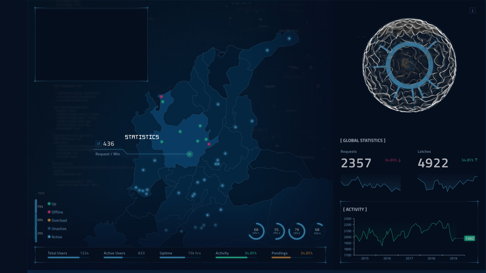
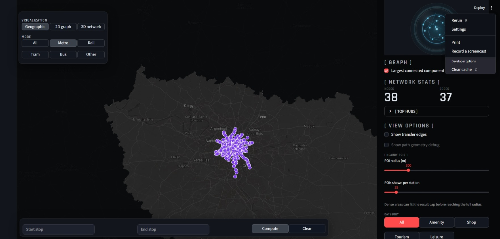
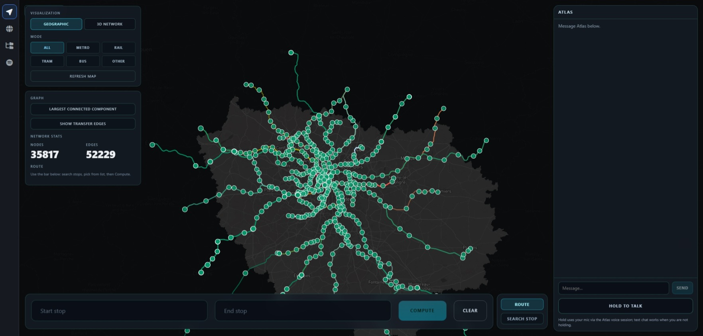

# Guide d’utilisation — Exploration intelligente d’un réseau de transport

Ce guide explique comment **installer, lancer et utiliser** le prototype. Il s’adresse à un utilisateur qui découvre le projet pour la première fois (par exemple un étudiant du semestre suivant).

L’application permet d’**explorer un réseau de transport** construit à partir de données **GTFS** (Île-de-France), avec :

- une **carte 2D** (Mapbox) ;
- une **visualisation 3D / VR** du graphe (GraphXR) ;
- l’agent conversationnel **Atlas**, en **texte** ou **voix**, pour piloter l’interface en langage naturel.

---

## Table des matières

1. [Présentation rapide](#1-présentation-rapide)
2. [Prérequis](#2-prérequis)
3. [Clés API nécessaires](#3-clés-api-nécessaires)
4. [Lancement de l’application](#4-lancement-de-lapplication)
5. [Lancement avec mode VR / Meta Quest](#5-lancement-avec-mode-vr--meta-quest)
6. [Interface principale](#6-interface-principale)
7. [Utiliser l’agent Atlas](#7-utiliser-lagent-atlas)
8. [Carte 2D](#8-carte-2d)
9. [Visualisation 3D avec GraphXR](#9-visualisation-3d-avec-graphxr)
10. [Mode VR](#10-mode-vr)
11. [Informations dynamiques et enrichissements](#11-informations-dynamiques-et-enrichissements)
12. [Exemples de scénarios complets](#12-exemples-de-scénarios-complets)
13. [Dépannage rapide](#13-dépannage-rapide)
14. [Limites à connaître](#14-limites-à-connaitre)

---

## 1. Présentation rapide

En quelques mots : vous ouvrez une page web, vous voyez une carte du réseau, et vous pouvez :

- **demander un itinéraire** (« de Châtelet à République ») ;
- **chercher une station** ;
- **afficher des arrêts ou POI** autour d’un lieu ;
- **passer en vue 3D ou VR** pour explorer la structure du graphe ;
- **demander des infos dynamiques** (prochains départs, perturbations) quand les API externes sont configurées.

Atlas comprend votre demande, choisit l’action adaptée, et l’application met à jour la carte ou la vue 3D lorsque la synchronisation fonctionne.

---

## 2. Prérequis

| Élément | Détail |
|--------|--------|
| **Système** | Windows recommandé (script de lancement en PowerShell) |
| **Python** | 3.11 ou 3.12 conseillé |
| **Environnement Python** | `.venv` à la racine du projet (`pip install -r requirements.txt`) |
| **Environnement Atlas** | Python dédié dans `src/work/atlas/.venv` (utilisé automatiquement par le script de lancement) |
| **Node.js / npm** | Pour le frontend React et le viewer GraphXR |
| **Navigateur** | Chrome ou Edge récent |
| **Internet** | Requis pour Mapbox, OpenAI, IDFM et autres services en ligne |
| **Casque VR (optionnel)** | Meta Quest ou autre navigateur compatible **WebXR**, pour la démo immersive |

**Première installation (résumé)**

1. Cloner ou récupérer le dépôt du projet.
2. Créer et activer un environnement Python à la racine, puis installer les dépendances :  
   `pip install -r requirements.txt`
3. Installer les dépendances du frontend :  
   `cd frontend` puis `npm install`
4. Installer les dépendances GraphXR (si besoin) :  
   `cd viewers/graphxr` puis `npm install`
5. Créer un fichier `.env` à la racine (voir section 3).
6. Lancer l’application (section 4).

> **Note :** le graphe GTFS doit être disponible (bundle pré-calculé). Si le backend signale une erreur au démarrage, vérifiez la documentation technique du dépôt ou demandez au responsable du projet où se trouvent les données.

---

## 3. Clés API nécessaires

Copiez un fichier `.env` à la **racine du projet** et renseignez les clés ci-dessous. Sans certaines clés, seules les fonctions associées sont indisponibles ; le reste peut parfois fonctionner partiellement.

| Variable | Rôle | Si absente |
|----------|------|------------|
| `OPENAI_API_KEY` | Agent Atlas (compréhension, planification, voix temps réel) | Pas de réponses Atlas |
| `MAPBOX_TOKEN` | Carte 2D Mapbox | Carte vide ou erreur d’affichage |
| `IDFM_API_KEY` | Données dynamiques IDFM / Navitia (départs, perturbations, enrichissement station) | Pas de prochains départs ni infos IDFM |
| `AZURE_SPEECH_KEY` | Synthèse vocale (Atlas lit la réponse à voix haute) | Réponses texte uniquement |
| `AZURE_SPEECH_REGION` | Région Azure Speech (optionnel ; défaut **`francecentral`** dans le code) | Utilise la valeur par défaut si la clé Azure est présente |
| `SERPAPI_API_KEY` | Recherche web / enrichissements en ligne (outils Atlas) | Recherches web désactivées |

Exemple minimal (sans valeurs réelles) :

```env
OPENAI_API_KEY=
MAPBOX_TOKEN=
IDFM_API_KEY=
AZURE_SPEECH_KEY=
SERPAPI_API_KEY=
```

---

## 4. Lancement de l’application

### Commande principale

Depuis la **racine du projet**, dans PowerShell :

```powershell
.\run_web_app.ps1
```

Ce script démarre, dans l’ordre :

1. **Atlas** (agent IA, API interne) ;
2. le **backend** FastAPI (transport, chat, synchronisation UI) ;
3. le **viewer GraphXR** (3D / VR) ;
4. le **frontend** Vite (interface web).

Attendez les messages « ready » dans le terminal, puis ouvrez l’URL affichée pour le frontend (souvent **`http://127.0.0.1:5173`**).

Pour arrêter tout : `Ctrl+C` dans la fenêtre où le script tourne.

### Services et ports (valeurs par défaut)

| Service | Rôle | URL / port local |
|---------|------|------------------|
| **Frontend** (React / Vite) | Interface utilisateur | `http://127.0.0.1:5173` |
| **Backend** (FastAPI) | Transport, carte, file de commandes UI, proxy chat | `http://127.0.0.1:8787` |
| **Atlas** (agent IA) | Planification et exécution des outils | `http://127.0.0.1:5055` |
| **GraphXR** | Viewer 3D / WebXR | `http://127.0.0.1:3000/viewer` |

En usage normal sur PC, le frontend appelle le backend via le **proxy Vite** (`/api` → port 8787). Vous n’avez pas besoin d’ouvrir le port 8787 dans le navigateur.

**Options utiles du script**

| Option | Effet |
|--------|--------|
| `-SkipAtlas` | Ne démarre pas Atlas (le chat ne fonctionnera pas) |
| `-SkipGraphXR` | Ne démarre pas le viewer 3D |
| `-QuestVR` | Mode Meta Quest (HTTPS, voir section 5) |

---

## 5. Lancement avec mode VR / Meta Quest

WebXR exige une connexion **HTTPS**. En mode Quest, le script lance un **proxy local** (port **8080**) et un tunnel **ngrok** qui expose une URL HTTPS publique.

```powershell
.\run_web_app.ps1 -QuestVR
```

**Étapes côté utilisateur**

1. Lancer la commande ci-dessus et attendre l’URL HTTPS affichée (ex. `https://xxxx.ngrok-free.dev`).
2. Sur le **Meta Quest**, ouvrir le navigateur et saisir cette **URL HTTPS** (pas une adresse `http://` locale).
3. Aller dans le mode transport, ouvrir **3D/VR graph**, puis activer **VR** dans GraphXR.
4. PC et casque doivent être **connectés à Internet** ; idéalement sur le **même réseau Wi‑Fi**.

**Sur PC (hors casque)**  
Vous pouvez continuer à utiliser `http://127.0.0.1:5173`, mais en mode `-QuestVR` l’API peut être configurée via l’URL ngrok. Pour un usage PC simple, préférez **`.\run_web_app.ps1`** sans `-QuestVR`.

> L’URL ngrok gratuite **change à chaque lancement**. Ne la copiez pas durablement dans `.env`.

---

## 6. Interface principale



| Zone | Description |
|------|-------------|
| **Carte 2D** | Carte Mapbox au centre (stations, itinéraires, surlignages) |
| **Panneau Atlas** | Rail à droite : historique de chat, saisie texte, bouton **Hold to talk** |
| **Contrôles transport** | Panneau à gauche : type de vue, couche du graphe, mode (métro, RER, bus…), statistiques réseau, détail d’itinéraire |
| **Barre du bas** | Saisie manuelle d’itinéraire ou recherche de station (onglets **Route** / **Search**) |
| **Vue 3D / VR** | Bouton **3D/VR graph** : remplace la carte par le viewer GraphXR |

**Raccourci utile** : touche **F** — affichage carte plein écran (masque une partie des panneaux).

---

## 7. Utiliser l’agent Atlas

Atlas accepte le **français** et l’**anglais**, en **texte** (champ *Message…* + *Send*) ou en **voix** (*Hold to talk* — maintenir le bouton, parler, relâcher pour revenir au texte).

### Exemples de commandes

| Commande exemple | Action déclenchée | Résultat attendu |
|------------------|-------------------|------------------|
| « Calcule un itinéraire de République à Orly » | Calcul d’itinéraire | Réponse Atlas + tracé sur la carte (si sync OK) |
| « Cherche la station Châtelet » | Recherche / centrage carte | Station mise en avant sur la carte |
| « Montre les POI autour de Gare de l’Est » | Exploration de zone | POI et arrêts affichés sur la carte |
| « Ouvre la visualisation 3D » | Bascule GraphXR | Vue graphe 3D (éventuellement synchronisée avec l’itinéraire) |
| « Affiche les prochains départs à Gare de l’Est » | Consultation IDFM | Réponse textuelle avec horaires (clé IDFM requise) |
| « Passe en mode métro » | Filtre du graphe | Réseau filtré sur le métro |
| « Affiche les arrêts autour de République » | Arrêts à proximité | Marqueurs autour du centre sur la carte |

Atlas répond dans le panneau de droite. La carte ou GraphXR se met à jour **quelques secondes après**, via une file de commandes interne — ce n’est pas instantané.

---

## 8. Carte 2D



### Types de vue (panneau *Visualization*)

| Bouton | Description |
|--------|-------------|
| **Geographic** | Carte classique vue du dessus |
| **3D map** | Carte Mapbox inclinée avec bâtiments 3D |
| **3D/VR graph** | Ouvre GraphXR (section 9) |

### Couche du graphe (*Graph layer*)

| Bouton | Description |
|--------|-------------|
| **Stops** | Arrêts (quais / points GTFS) |
| **Stations** | Regroupement par station (recommandé pour les itinéraires) |
| **Both** | Les deux niveaux |

### Mode de transport (*Mode*)

Filtre le réseau affiché : **all**, **metro**, **rail**, **tram**, **bus**, **other**.

### Utilisation manuelle (sans Atlas)

1. Onglet **Route** dans la barre du bas : saisir départ et arrivée, puis **Compute**.
2. Onglet **Search** : taper au moins 2 caractères, choisir un résultat dans la liste.
3. **Refresh map** : recharge la carte avec les options actuelles.

### Lire les résultats

- **Route meta** : durée, correspondances, résumé ;
- **Route legs** : détail segment par segment ;
- messages d’erreur en rouge si aucun chemin n’est trouvé.

---

## 9. Visualisation 3D avec GraphXR



GraphXR sert à **explorer la structure du graphe** (nœuds = arrêts ou stations, liens = connexions du réseau), pas à remplacer la carte géographique.

### Ouvrir GraphXR

- Cliquer sur **3D/VR graph** dans le panneau de gauche, **ou**
- Demander à Atlas : « Ouvre la visualisation 3D » / « Ouvre le graphe 3D ».

Un itinéraire calculé peut être **synchronisé** dans la vue 3D lorsque l’agent le demande explicitement (par ex. « ouvre la carte 3D » après un trajet).

### Navigation (souris / clavier)

- Déplacer la caméra autour du graphe ;
- Filtrer ou inspecter des nœuds via les panneaux GraphXR ;
- Comparer visuellement la densité des connexions selon le **mode** (métro, rail, etc.) choisi dans l’interface principale.

Bouton **← Map** : revenir à la carte 2D.

---

## 10. Mode VR

Le mode VR permet d’**entrer dans le graphe** avec un casque compatible WebXR (démo immersive).

| Action | Description |
|--------|-------------|
| Ouvrir l’**URL HTTPS** (mode `-QuestVR`) | Accéder à l’application depuis le casque |
| Passer en **3D/VR graph** | Charger GraphXR |
| Activer **VR** / **Enter VR** | Démarrer la session WebXR |
| Explorer le graphe | Se déplacer et observer nœuds et arêtes en 3D |

**Important :** la VR nécessite **HTTPS** sur Quest. C’est une fonctionnalité de **démonstration**, pas une version produit finalisée.

---

## 11. Informations dynamiques et enrichissements

Certaines commandes Atlas vont au-delà du graphe local :

| Type d’info | Source | Clé requise |
|-------------|--------|-------------|
| Prochains départs | API IDFM / Navitia | `IDFM_API_KEY` |
| Perturbations, accessibilité gare | IDFM | `IDFM_API_KEY` |
| Horaires / topic « hours » | IDFM | `IDFM_API_KEY` |
| Recherche web complémentaire | SerpAPI | `SERPAPI_API_KEY` |

Ces réponses apparaissent surtout dans le **chat Atlas**. Les horaires dépendent de la disponibilité des services externes (latence, quotas, erreurs API possibles).

---

## 12. Exemples de scénarios complets

### Scénario 1 — Trouver une station

| Étape | Détail |
|-------|--------|
| **Commande** | « Cherche la station Châtelet » |
| **Action** | Atlas résout le nom et synchronise la carte |
| **Résultat attendu** | Carte centrée ou station surlignée ; suggestion dans l’onglet Search |

### Scénario 2 — Calculer un itinéraire

| Étape | Détail |
|-------|--------|
| **Commande** | « Calcule un itinéraire de Châtelet à République » |
| **Action** | Calcul sur le graphe + envoi du tracé à l’interface |
| **Résultat attendu** | Réponse Atlas (durée, correspondances) + itinéraire coloré sur la carte + champs départ/arrivée remplis |

### Scénario 3 — POI puis vue 3D

| Étape | Détail |
|-------|--------|
| **Commande 1** | « Montre les POI autour de Gare de l’Est » |
| **Commande 2** | « Ouvre la visualisation 3D » |
| **Action** | Exploration locale puis bascule GraphXR |
| **Résultat attendu** | POI visibles sur la carte 2D, puis graphe 3D (itinéraire synchronisé si un trajet était actif) |

---

## 13. Dépannage rapide

| Problème | Piste de solution |
|----------|-------------------|
| **La carte ne s’affiche pas** | Vérifier `MAPBOX_TOKEN` dans `.env` ; cliquer sur **Refresh map** |
| **Atlas ne répond pas** | Vérifier `OPENAI_API_KEY` ; confirmer qu’Atlas tourne (port 5055) ; relancer `.\run_web_app.ps1` |
| **Pas de prochains départs** | Vérifier `IDFM_API_KEY` et la connexion Internet |
| **Pas de voix / pas de lecture audio** | Vérifier `AZURE_SPEECH_KEY` ; autoriser le micro pour la voix ; le mode texte fonctionne sans Azure |
| **GraphXR ne s’ouvre pas** | Vérifier que le viewer est démarré (`http://127.0.0.1:3000/viewer`) ; relancer sans `-SkipGraphXR` |
| **VR ne démarre pas sur Quest** | Utiliser `.\run_web_app.ps1 -QuestVR` et l’**URL HTTPS** ngrok (pas `http://` local) |
| **Atlas répond mais la carte ne change pas** | Garder l’onglet du navigateur ouvert ; en mode `-QuestVR`, ouvrir la même origine que l’API (URL ngrok) ou lancer sans `-QuestVR` sur PC ; vérifier que le backend répond (`http://127.0.0.1:8787/api/health`) |
| **Erreur au premier lancement** | Vérifier Python, `npm install`, présence du bundle GTFS ; consulter `logs/activity_compact.log` |

**Logs utiles** (racine du projet) :

```powershell
Get-Content logs\activity_compact.log -Wait
```

---

## 14. Limites à connaître

- **Prototype de démonstration** — pas une application de transport grand public.
- **Routage simplifié** — basé sur le graphe GTFS (nombre de correspondances, pas un moteur temps réel complet).
- **Données incomplètes possibles** — certaines lignes, POI ou horaires peuvent manquer.
- **API externes** — IDFM, OpenAI ou Mapbox peuvent être lents ou indisponibles.
- **Synchronisation UI** — un décalage entre la réponse Atlas et la mise à jour carte / 3D peut survenir.
- **Mode VR** — dépend de HTTPS, ngrok et du navigateur du casque ; prévu pour la démo, pas pour un déploiement industriel.
- **Environnement Windows** — le script principal est en PowerShell ; adaptation nécessaire sur Linux ou macOS.

---

*Guide rédigé pour le prototype « Exploration intelligente d’un réseau de transport » — agent conversationnel Atlas, carte Mapbox, viewer GraphXR. Les ports et URLs peuvent varier légèrement selon la configuration locale.*
