# CSPE Project Architecture

This document describes the **CSPE** (Combined Spatial Product Environment) stack as implemented in the repository: a local full-stack application for exploring and routing on **Île-de-France public transport**, with an **Atlas** AI assistant that drives the UI through a shell command queue.

Diagrams use [Mermaid](https://mermaid.js.org/). They render in GitHub, VS Code, and most modern markdown viewers.

---

## Table of contents

1. [System overview](#1-system-overview)
2. [Runtime processes and ports](#2-runtime-processes-and-ports)
3. [Repository layout](#3-repository-layout)
4. [Frontend architecture](#4-frontend-architecture)
5. [Product shell (FastAPI BFF)](#5-product-shell-fastapi-bff)
6. [Atlas agent](#6-atlas-agent)
7. [Transport and data pipeline](#7-transport-and-data-pipeline)
8. [Viewers: 2D map and GraphXR 3D/VR](#8-viewers-2d-map-and-graphxr-3dvr)
9. [Integration flows](#9-integration-flows)
10. [Quest VR mode](#10-quest-vr-mode)

---

## 1. System overview

At runtime, CSPE is a set of cooperating processes on localhost (or LAN). The browser talks to the **React frontend** and, through it or directly, to the **product shell API**. Atlas runs as a separate Flask service; tools call back into the product shell, which enqueues **shell commands** for the browser.

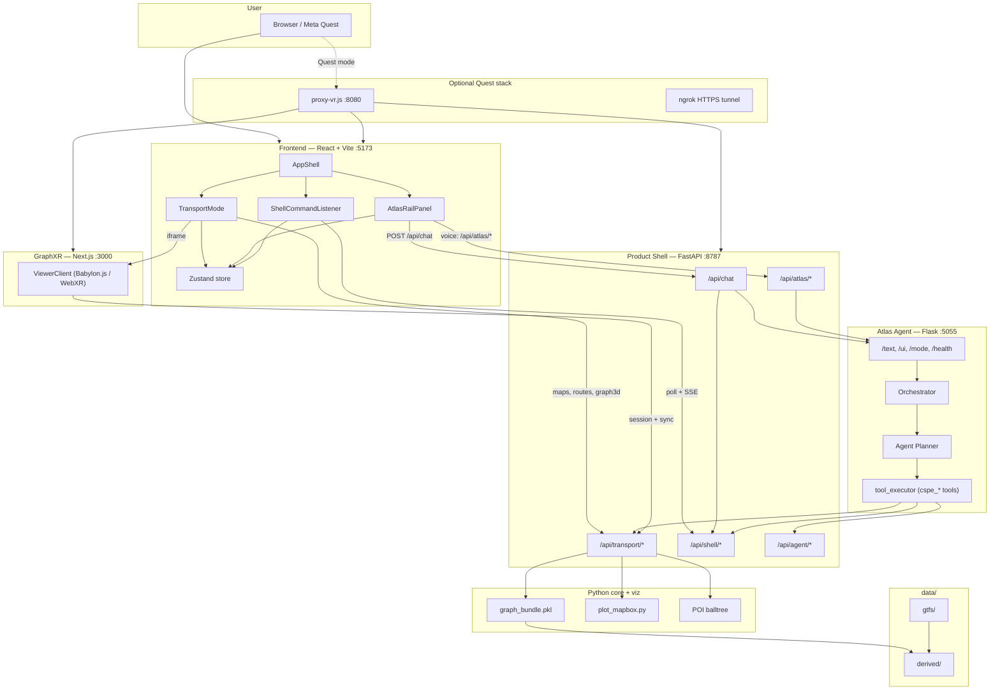

**Roles in one sentence each:**

| Layer | Role |
|-------|------|
| **Frontend** | Transport UI, map iframe, embedded 3D/VR iframe, Atlas chat/voice rail |
| **Product shell** | Single BFF: transport engine, shell queue, chat proxy, agent context |
| **Atlas** | NL planner + tool execution; never touches the browser directly |
| **Core / viz** | GTFS graphs, routing, Mapbox HTML generation, POI search |
| **GraphXR** | Standalone 3D/WebXR viewer consuming graph sessions from the BFF |
| **Data** | Offline GTFS-derived artifacts and runtime caches |

---

## 2. Runtime processes and ports

Launched by `run_web_app.ps1` from the repo root.

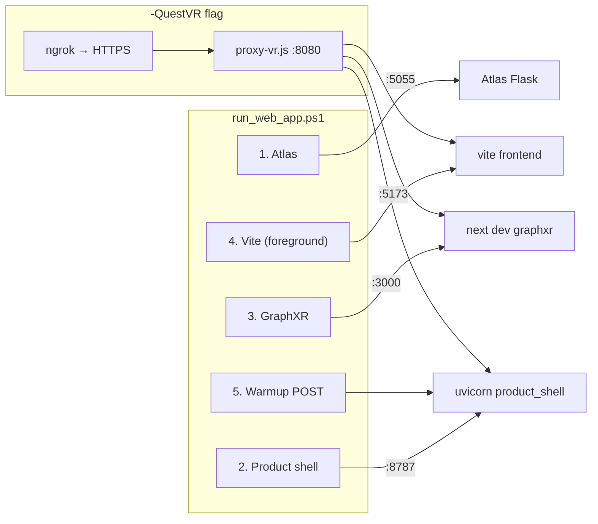

| Port | Process | Entry / command | Purpose |
|------|---------|-----------------|---------|
| **5055** | Atlas Flask | `python -m atlas_client.app.run_api` in `src/work/atlas/` | Text/voice agent, planner, tools |
| **8787** | Product shell | `uvicorn backend.product_shell.main:app` | All `/api/*` for UI and Atlas tools |
| **5173** | Vite dev server | `npm run dev` in `frontend/` | React SPA; proxies `/api` → :8787 |
| **3000** | GraphXR | `npm run dev` in `viewers/graphxr/` | 3D/VR viewer at `/viewer` |
| **8080** | VR proxy | `node proxy-vr.js` (Quest mode) | Single HTTP entry for headset |
| **4040** | ngrok dashboard | ngrok CLI (Quest mode) | Public HTTPS URL for Quest WebXR |

**Launcher flags:**

- `-SkipAtlas` — skip Atlas; chat needs something on :5055
- `-SkipGraphXR` — skip viewer; set `VITE_GRAPHXR_VIEWER_URL` if running elsewhere
- `-QuestVR` — start proxy + ngrok; override `VITE_API_BASE` and `VITE_GRAPHXR_VIEWER_URL` with ngrok host

**Key environment variables:**

| Variable | Default / role |
|----------|----------------|
| `PRODUCT_SHELL_URL` | `http://127.0.0.1:8787` — Atlas tools call this |
| `CSPE_FRONTEND_URL` | `http://127.0.0.1:5173` — open map in browser |
| `VITE_API_BASE` | Same-origin `/api` in dev; ngrok URL in Quest mode |
| `VITE_GRAPHXR_VIEWER_URL` | `http://127.0.0.1:3000/viewer` |
| `MAPBOX_TOKEN` | Required for map HTML generation |
| `IDFM_API_KEY` | Optional live Navitia enrichment |
| `ATLAS_PYTHON` | Python executable for Atlas subprocess |

---

## 3. Repository layout

```mermaid
flowchart TB
  Root["CSPE repo root"]

  Root --> FE["frontend/"]
  Root --> BE["backend/product_shell/"]
  Root --> SRC["src/"]
  Root --> Atlas["src/work/atlas/"]
  Root --> Viewers["viewers/graphxr/"]
  Root --> Data["data/"]
  Root --> Scripts["scripts/"]
  Root --> Tests["tests/"]
  Root --> Docs["docs/"]
  Root --> Logs["logs/"]

  FE --> FEApp["src/ — React app"]
  FE --> FEVite["vite.config.ts — :5173, /api proxy"]

  BE --> Routers["routers/ — chat, transport, shell, agent, atlas"]
  BE --> Services["services/ — atlas_http, agent_tools, idfm, warmup"]
  BE --> Engine["transport_engine.py"]

  SRC --> Core["core/ — graph, routing, stations, POI"]
  SRC --> Viz["viz/ — plot_mapbox, paris_mask"]

  Data --> GTFS["gtfs/ — raw GTFS"]
  Data --> Derived["derived/ — graphs, indexes, caches"]
  Data --> Normalized["normalized/ — poi.parquet"]

  Atlas --> AtlasClient["atlas_client/ — app, core, router"]
```

| Path | Responsibility |
|------|----------------|
| `frontend/` | React 19 + Vite SPA: transport map, Atlas rail, shell listener |
| `backend/product_shell/` | FastAPI BFF on :8787 |
| `src/core/` | GTFS → NetworkX graphs, routing queries, station layer, POI index |
| `src/viz/` | Server-side Mapbox GL HTML |
| `src/work/atlas/` | Embedded Atlas runtime (Flask, orchestrator, planner, tools) |
| `viewers/graphxr/` | Next.js + Babylon.js 3D/WebXR graph viewer |
| `data/gtfs/` | Raw GTFS feeds |
| `data/derived/` | Built graphs, render JSON, map cache, IDFM CSVs |
| `scripts/` | Bundle rebuild, ops utilities |
| `tests/` | Python integration/unit tests |
| `proxy-vr.js` | Quest reverse proxy at repo root |
| `run_web_app.ps1` | Primary dev stack launcher |

---

## 4. Frontend architecture

The SPA is **transport-focused**: a single route `/` mounts `AppShell`, which fills the viewport with `TransportMode` and optionally shows `AtlasRailPanel` on the right.

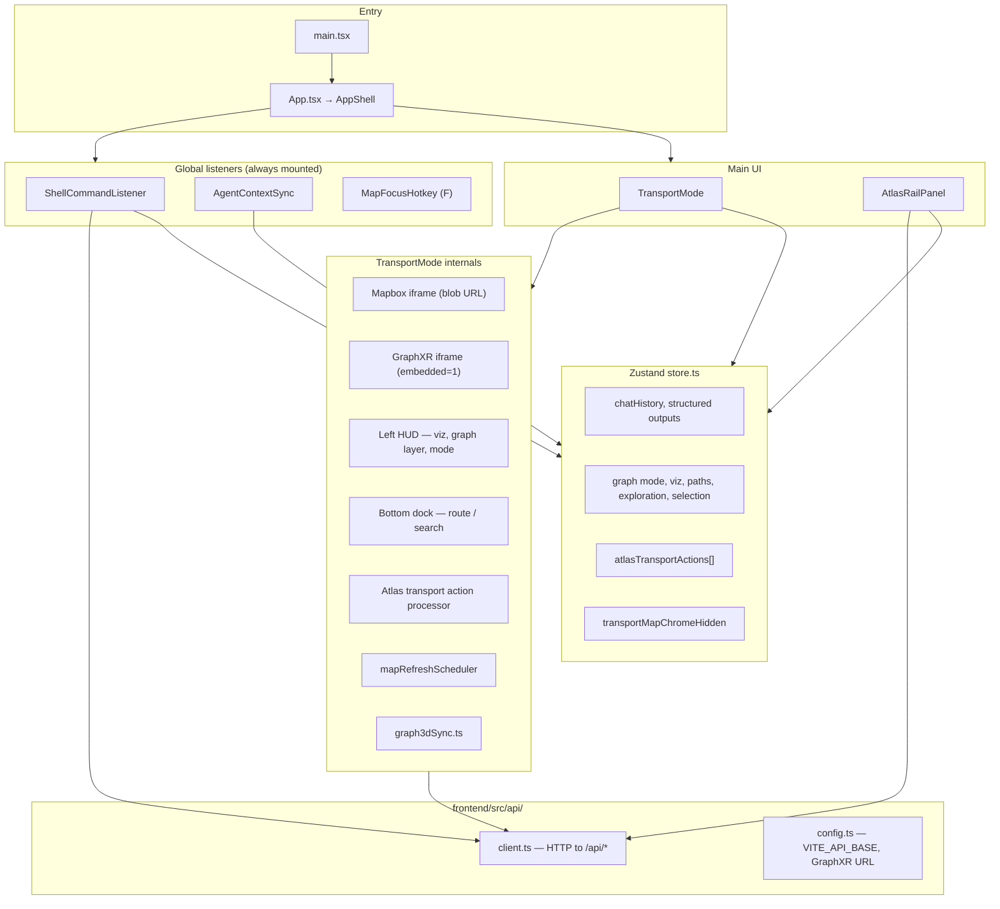

### Visualization modes (`transportViz`)

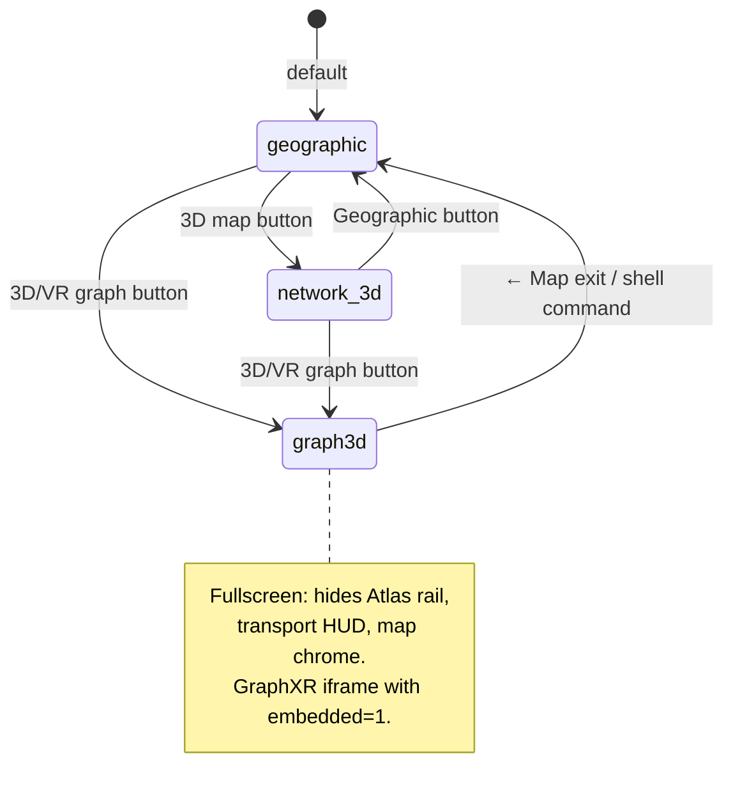

### Shell command kinds (browser)

Handled in `ShellCommandListener.tsx`:

| Command kind | Effect |
|--------------|--------|
| `set_mode` | Switch app mode (transport) |
| `transport_graph_mode` | `all` / `metro` / `rail` / … |
| `transport_options` | LCC, viz, graph_viz, transfers |
| `transport_route_view` | Path IDs, legs, route meta/errors |
| `transport_exploration_view` | Nearby stops/POIs, radius, summary |
| `transport_graph3d_sync` | Enable live sync + switch to graph3d |
| `atlas_transport_action` | Enqueue structured transport action spec |
| `apply_structured_outputs` | Push planner outputs into chat store |

Delivery: **SSE** primary (`GET /api/shell/stream`), **poll** backup every 300 ms (or 2 s when SSE enabled).

---

## 5. Product shell (FastAPI BFF)

Single process on **:8787**. All browser and Atlas-tool traffic for transport, shell, chat proxy, and agent context goes through here.

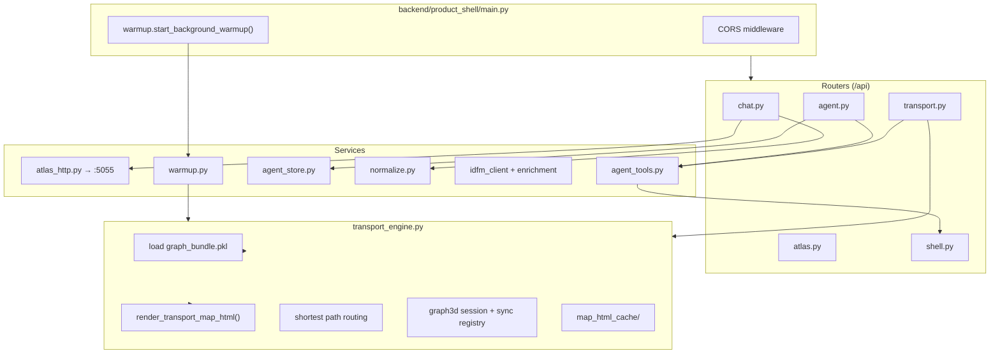

### Transport API surface

| Endpoint | Role |
|----------|------|
| `POST /transport/map` | Full Mapbox HTML from view state |
| `POST /transport/map/exploration-overlay` | Incremental exploration overlay |
| `POST /transport/map/route-overlay` | Route highlight overlay |
| `GET /transport/stops/search` | Autocomplete |
| `POST /transport/route` | Shortest-path route |
| `GET /transport/stops/nearby` | Nearby stops (+ optional `sync_ui`) |
| `GET /transport/pois/nearby` | Nearby POIs |
| `POST /transport/area/explore` | Combined area exploration |
| `POST /transport/graph3d/session` | Create 3D graph session |
| `GET /transport/graph3d/session/{id}` | Session project JSON for GraphXR |
| `POST /transport/graph3d/sync` | Push view fingerprint → new session |
| `GET /transport/graph3d/sync/{client_id}` | Poll for fingerprint changes |
| `GET /transport/stats` | Node/edge counts |

When handlers are called with `sync_ui=true`, `agent_tools` builds shell commands and `shell.py` enqueues them for the browser.

### Shell queue

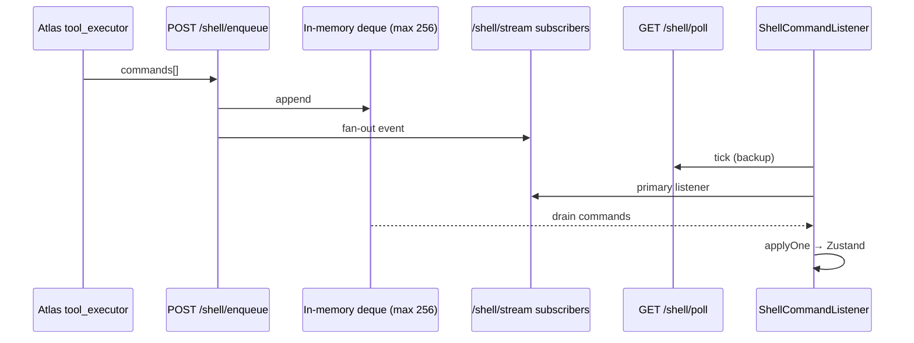

---

## 6. Atlas agent

Located under `src/work/atlas/`. Runs as a **separate Flask process** so its Python path and dependencies stay isolated from CSPE root imports.

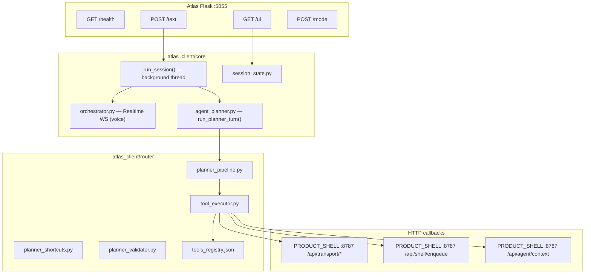

### Text chat path

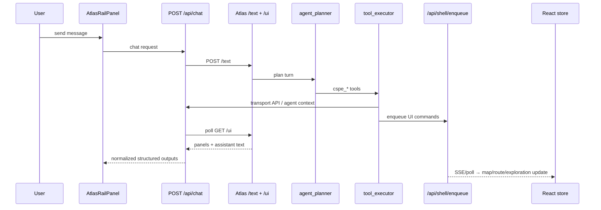

### Representative CSPE tools

| Tool | Typical action |
|------|----------------|
| `cspe_search_stops` | Stop/station search via product shell |
| `cspe_compute_route` | Route computation |
| `cspe_explore_area` | Area exploration + `sync_ui` shell commands |
| `cspe_nearby_stops` / `cspe_nearby_pois` | Proximity queries |
| `cspe_open_graph3d` | Shell enqueue → graph3d viz |
| `cspe_update_map` | Shell enqueue → map state sync |
| `cspe_get_current_context` | Read agent world state from BFF |
| `cspe_open_transport_map` | Open `CSPE_FRONTEND_URL` in browser |

---

## 7. Transport and data pipeline

Offline GTFS is compiled into routing graphs and supporting indexes. The product shell loads a **cached bundle** at startup (with optional background warmup).

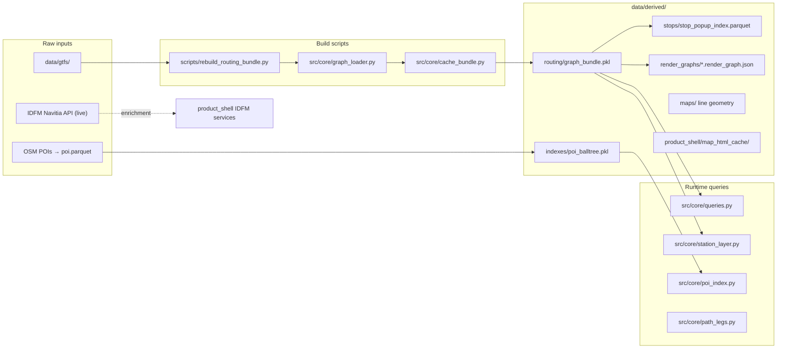

### Graph model (conceptual)

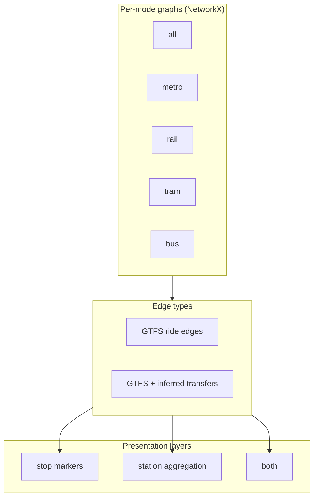

Routing is **stop-level** in the graph; **station paths** are derived via `station_layer.py` for station-first UI and summaries.

---

## 8. Viewers: 2D map and GraphXR 3D/VR

### 2D Mapbox map (embedded iframe)

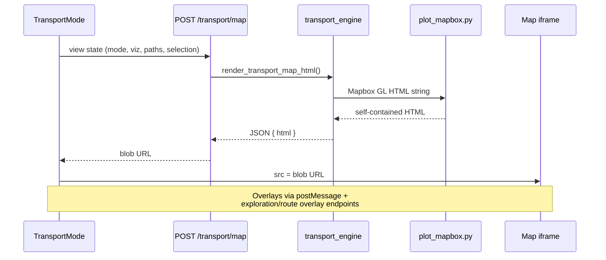

Map HTML is **generated server-side** (requires `MAPBOX_TOKEN`). The browser never talks to Mapbox directly for tile logic — it runs the returned HTML in a sandboxed iframe.

### GraphXR 3D/VR (embedded or standalone)

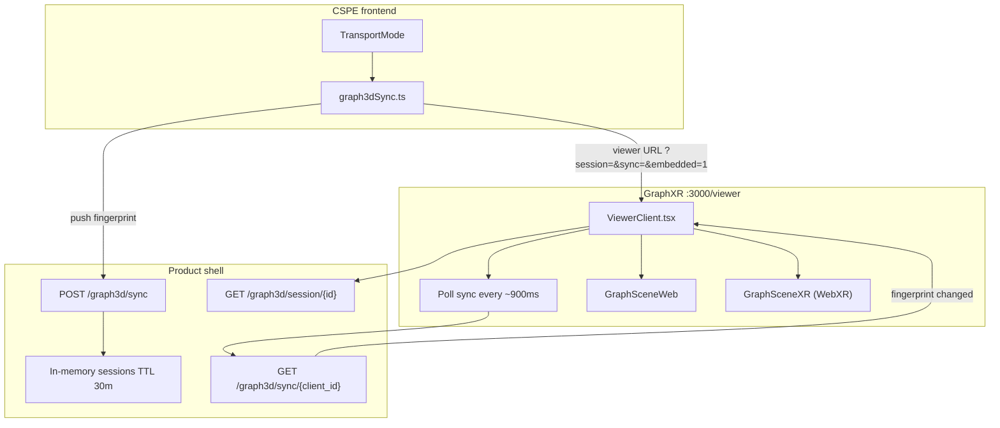

**Embedded mode** (`embedded=1` query param): hides GraphXR standalone header; viewer controls stay on the right. CSPE hides Atlas rail and transport HUD when `transportViz === "graph3d"`.

---

## 9. Integration flows

### End-to-end: “Route from A to B”

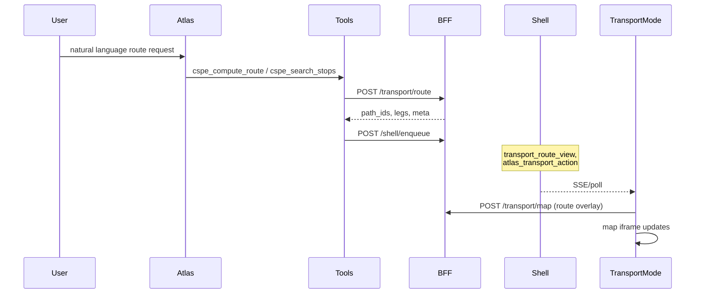

### End-to-end: “Explore restaurants near X”

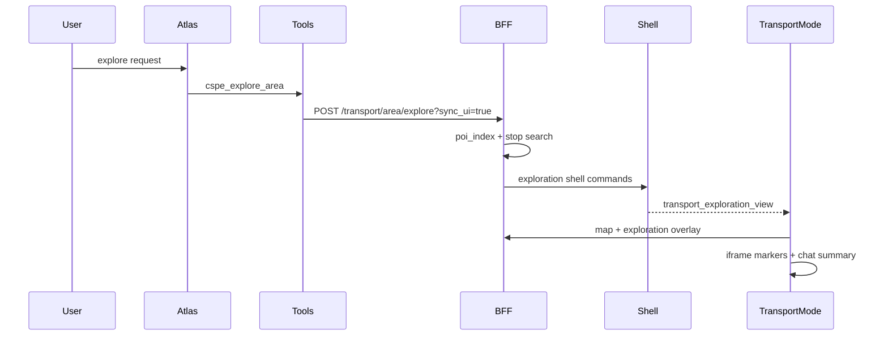

### Agent context loop

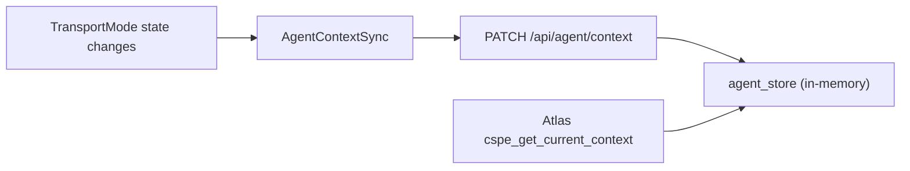

The BFF keeps a **server-side mirror** of transport focus (graph mode, paths, errors) so Atlas tools can read current UI context without parsing the DOM.

---

## 10. Quest VR mode

Meta Quest browsers require **HTTPS** for WebXR. `-QuestVR` puts a reverse proxy in front of the dev stack and tunnels it with ngrok.

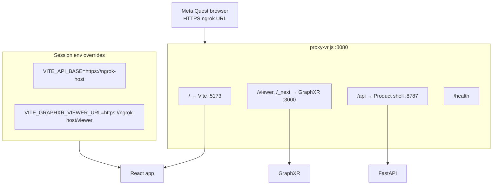

In-headset controls (GraphXR `GraphSceneXR.tsx`): thumbsticks for move/turn, trigger/grip for selection, A/X for menu. On-screen buttons: Reset, Labels, Filters, VR entry.

---

## Quick reference: who talks to whom

| From | To | Protocol |
|------|-----|----------|
| Browser | Vite :5173 | HTTP — SPA assets |
| Browser | Product shell :8787 | HTTP `/api/*` (proxied or direct) |
| Browser | GraphXR :3000 | iframe `/viewer?session=…` |
| Product shell | Atlas :5055 | HTTP `/text`, `/ui`, `/mode` |
| Atlas tools | Product shell :8787 | HTTP transport + shell + agent |
| GraphXR | Product shell :8787 | HTTP session + sync (via `?api=` param) |
| Product shell | Mapbox | Server-side token in `plot_mapbox.py` |
| Product shell | IDFM Navitia | Optional REST (`IDFM_API_KEY`) |

---

## Related docs

- [`docs/PROJECT_FULL_TECHNICAL_OVERVIEW.md`](PROJECT_FULL_TECHNICAL_OVERVIEW.md) — longer narrative overview (may include legacy modes)
- [`docs/LOCAL_PLANNER.md`](LOCAL_PLANNER.md) — Atlas planner pipeline details
- [`run_web_app.ps1`](../run_web_app.ps1) — stack launcher and port comments

---

*Generated from repository inspection. Ports and paths reflect the current tree; adjust if you change launcher scripts or env defaults.*
