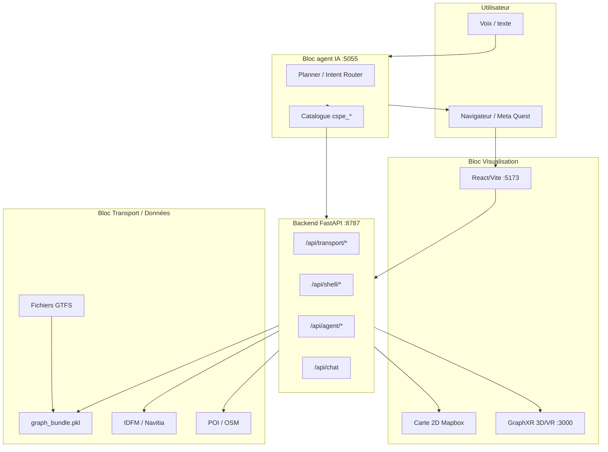
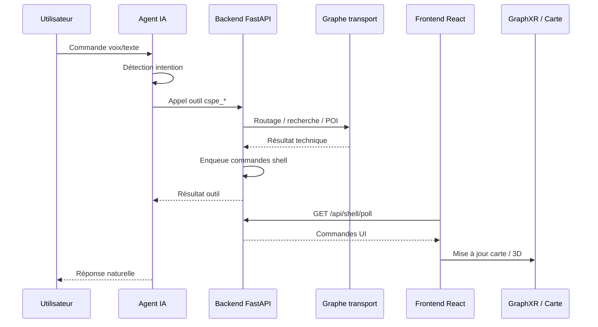
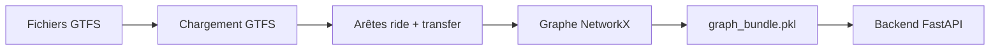
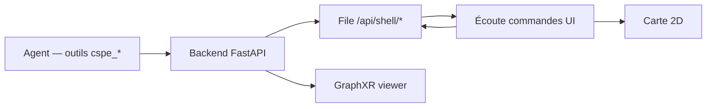

# Page de garde

**Titre officiel du projet (P26)**  
Couplage de la visualisation immersive avec une architecture agentique IA pour une interaction voice-to-command dédiée à l’exploration d’un graphe complexe de réseau de transport

**Titre de travail**  
Couplage de la visualisation immersive avec une architecture agentique IA pour l’exploration vocale d’un graphe de transport — Prototype ATLAS

---

**Étudiant :** Ismail KHOUNA  
**Tuteur Projet Étudiant :** Babiga BIRREGAH  
**Établissement :** Université de Technologie de Troyes (UTT)  
**Formation :** CSPE — 6 ECTS CS TCBR  
**Volume estimé :** 150 heures  
**Semestre :** [À COMPLÉTER : semestre et année universitaire exacts, par ex. S2 2025–2026]

**Projet Étudiant — CSPE / MIND**

---

# Résumé

Ce Projet Étudiant propose un **prototype fonctionnel démontrable** répondant au sujet officiel P26 : coupler visualisation immersive, architecture agentique IA et interaction voice-to-command pour l’exploration d’un graphe complexe de réseau de transport. L’objectif est de permettre à un utilisateur d’explorer un réseau de transport en combinant un **graphe GTFS** modélisant le réseau Île-de-France, des **interfaces de visualisation** (carte 2D Mapbox et module immersif GraphXR 3D/VR), et un **agent IA conversationnel** capable d’interpréter des commandes naturelles, principalement vocales.

Dans ce prototype, l’agent IA conversationnel a été nommé **ATLAS**. Ce nom désigne la couche d’orchestration chargée d’interpréter les commandes utilisateur et de déclencher les outils adaptés ; il ne correspond pas à une exigence explicite du cahier des charges, qui demandait un agent orchestrateur couplé à la visualisation immersive et à la commande vocale.

L’architecture repose sur trois blocs principaux — agent IA, moteur transport basé sur un graphe GTFS, et interfaces de visualisation 2D/3D/VR — reliés par un **backend FastAPI** jouant le rôle de couche d’intégration. OpenAI ne pilote pas directement l’application de manière libre : il interprète la demande utilisateur, identifie l’intention et sélectionne des outils codés (`cspe_*`), exécutés ensuite par le backend pour interagir avec le graphe, la carte ou GraphXR.

Le prototype obtenu permet de calculer des itinéraires, rechercher des stations, explorer des POI, afficher des résultats sur une carte 2D, ouvrir une visualisation 3D/VR synchronisée, et obtenir des enrichissements secondaires via des API externes (IDFM/Navitia, recherche web). Le calcul d’itinéraire repose principalement sur le **nombre de sauts** dans le graphe, enrichi par un résumé distance/temps ; il ne constitue pas un moteur de routage temps réel comparable à des applications grand public.

Les principales limites concernent la complétude des données, le coût de construction initiale du graphe (nécessité d’un bundle pré-calculé), la latence de la chaîne voix → IA → backend → interface, et des bugs occasionnels de synchronisation entre la réponse de l’agent et la mise à jour de la carte ou de GraphXR. Le mode VR sur Meta Quest a été validé en démonstration, avec une configuration HTTPS via proxy/ngrok. Le projet vise une démonstration académique, sans objectif d’industrialisation.

**Mots-clés :** graphe de transport, GTFS, NetworkX, agent IA, tool-calling, visualisation immersive, WebXR, FastAPI, React, Mapbox, GraphXR, exploration vocale, voice-to-command.

---

# Table des matières

**1. [Introduction](#1-introduction)**  
&nbsp;&nbsp;&nbsp;&nbsp;1.1 [Contexte général](#11-contexte-général)  
&nbsp;&nbsp;&nbsp;&nbsp;1.2 [Problématique](#12-problématique)  
&nbsp;&nbsp;&nbsp;&nbsp;1.3 [Objectifs du projet](#13-objectifs-du-projet)  
&nbsp;&nbsp;&nbsp;&nbsp;1.4 [Périmètre du prototype](#14-périmètre-du-prototype)  
&nbsp;&nbsp;&nbsp;&nbsp;1.5 [Organisation du rapport](#15-organisation-du-rapport)

**2. [Démarche menée et analyse du besoin](#2-démarche-menée-et-analyse-du-besoin)**  
&nbsp;&nbsp;&nbsp;&nbsp;2.1 [Compréhension du contexte](#21-compréhension-du-contexte)  
&nbsp;&nbsp;&nbsp;&nbsp;2.2 [Public cible et cas d’usage](#22-public-cible-et-cas-dusage)  
&nbsp;&nbsp;&nbsp;&nbsp;2.3 [Besoins fonctionnels](#23-besoins-fonctionnels)  
&nbsp;&nbsp;&nbsp;&nbsp;&nbsp;&nbsp;&nbsp;&nbsp;2.3.1 [Besoins critiques](#231-besoins-critiques)  
&nbsp;&nbsp;&nbsp;&nbsp;&nbsp;&nbsp;&nbsp;&nbsp;2.3.2 [Besoins importants](#232-besoins-importants)  
&nbsp;&nbsp;&nbsp;&nbsp;&nbsp;&nbsp;&nbsp;&nbsp;2.3.3 [Besoins souhaitables](#233-besoins-souhaitables)  
&nbsp;&nbsp;&nbsp;&nbsp;2.4 [Contraintes du projet](#24-contraintes-du-projet)  
&nbsp;&nbsp;&nbsp;&nbsp;&nbsp;&nbsp;&nbsp;&nbsp;2.4.1 [Contraintes pédagogiques](#241-contraintes-pédagogiques)  
&nbsp;&nbsp;&nbsp;&nbsp;&nbsp;&nbsp;&nbsp;&nbsp;2.4.2 [Contraintes techniques](#242-contraintes-techniques)  
&nbsp;&nbsp;&nbsp;&nbsp;&nbsp;&nbsp;&nbsp;&nbsp;2.4.3 [Contraintes organisationnelles](#243-contraintes-organisationnelles)  
&nbsp;&nbsp;&nbsp;&nbsp;2.5 [État de l’art et positionnement](#25-état-de-lart-et-positionnement)  
&nbsp;&nbsp;&nbsp;&nbsp;&nbsp;&nbsp;&nbsp;&nbsp;2.5.1 [Graphes de transport et GTFS](#251-graphes-de-transport-et-gtfs)  
&nbsp;&nbsp;&nbsp;&nbsp;&nbsp;&nbsp;&nbsp;&nbsp;2.5.2 [Visualisation 2D, 3D et VR](#252-visualisation-2d-3d-et-vr)  
&nbsp;&nbsp;&nbsp;&nbsp;&nbsp;&nbsp;&nbsp;&nbsp;2.5.3 [Agents IA et tool-calling](#253-agents-ia-et-tool-calling)  
&nbsp;&nbsp;&nbsp;&nbsp;&nbsp;&nbsp;&nbsp;&nbsp;2.5.4 [Positionnement du prototype](#254-positionnement-du-prototype)

**3. [Conception et architecture du prototype](#3-conception-et-architecture-du-prototype)**  
&nbsp;&nbsp;&nbsp;&nbsp;3.1 [Architecture générale](#31-architecture-générale)  
&nbsp;&nbsp;&nbsp;&nbsp;&nbsp;&nbsp;&nbsp;&nbsp;3.1.1 [Bloc agent IA](#311-bloc-agent-ia)  
&nbsp;&nbsp;&nbsp;&nbsp;&nbsp;&nbsp;&nbsp;&nbsp;3.1.2 [Bloc transport et données](#312-bloc-transport-et-données)  
&nbsp;&nbsp;&nbsp;&nbsp;&nbsp;&nbsp;&nbsp;&nbsp;3.1.3 [Bloc visualisation](#313-bloc-visualisation)  
&nbsp;&nbsp;&nbsp;&nbsp;&nbsp;&nbsp;&nbsp;&nbsp;3.1.4 [Backend FastAPI comme couche d’intégration](#314-backend-fastapi-comme-couche-dintégration)  
&nbsp;&nbsp;&nbsp;&nbsp;&nbsp;&nbsp;&nbsp;&nbsp;3.1.5 [Diagramme d’architecture globale](#315-diagramme-darchitecture-globale)  
&nbsp;&nbsp;&nbsp;&nbsp;&nbsp;&nbsp;&nbsp;&nbsp;3.1.6 [Séquence d’une commande utilisateur](#316-séquence-dune-commande-utilisateur)  
&nbsp;&nbsp;&nbsp;&nbsp;3.2 [Données et graphe de transport](#32-données-et-graphe-de-transport)  
&nbsp;&nbsp;&nbsp;&nbsp;&nbsp;&nbsp;&nbsp;&nbsp;3.2.1 [Données GTFS](#321-données-gtfs)  
&nbsp;&nbsp;&nbsp;&nbsp;&nbsp;&nbsp;&nbsp;&nbsp;3.2.2 [Transformation en graphe](#322-transformation-en-graphe)  
&nbsp;&nbsp;&nbsp;&nbsp;&nbsp;&nbsp;&nbsp;&nbsp;3.2.3 [Moteur transport](#323-moteur-transport)  
&nbsp;&nbsp;&nbsp;&nbsp;&nbsp;&nbsp;&nbsp;&nbsp;3.2.4 [Routage et limites](#324-routage-et-limites)  
&nbsp;&nbsp;&nbsp;&nbsp;&nbsp;&nbsp;&nbsp;&nbsp;3.2.5 [POI et enrichissements](#325-poi-et-enrichissements)  
&nbsp;&nbsp;&nbsp;&nbsp;3.3 [Agent IA conversationnel](#33-agent-ia-conversationnel)  
&nbsp;&nbsp;&nbsp;&nbsp;&nbsp;&nbsp;&nbsp;&nbsp;3.3.1 [Rôle de l’agent orchestrateur](#331-rôle-de-lagent-orchestrateur)  
&nbsp;&nbsp;&nbsp;&nbsp;&nbsp;&nbsp;&nbsp;&nbsp;3.3.2 [Interaction vocale et mode texte](#332-interaction-vocale-et-mode-texte)  
&nbsp;&nbsp;&nbsp;&nbsp;&nbsp;&nbsp;&nbsp;&nbsp;3.3.3 [Outils contrôlés par l’agent](#333-outils-contrôlés-par-lagent)  
&nbsp;&nbsp;&nbsp;&nbsp;&nbsp;&nbsp;&nbsp;&nbsp;3.3.4 [Modèles locaux, choix d’OpenAI et réponse naturelle](#334-modèles-locaux-choix-dopenai-et-réponse-naturelle)  
&nbsp;&nbsp;&nbsp;&nbsp;3.4 [Visualisation 2D, 3D et VR](#34-visualisation-2d-3d-et-vr)  
&nbsp;&nbsp;&nbsp;&nbsp;&nbsp;&nbsp;&nbsp;&nbsp;3.4.1 [Interface React/Vite](#341-interface-reactvite)  
&nbsp;&nbsp;&nbsp;&nbsp;&nbsp;&nbsp;&nbsp;&nbsp;3.4.2 [Carte 2D](#342-carte-2d)  
&nbsp;&nbsp;&nbsp;&nbsp;&nbsp;&nbsp;&nbsp;&nbsp;3.4.3 [Intégration GraphXR](#343-intégration-graphxr)  
&nbsp;&nbsp;&nbsp;&nbsp;&nbsp;&nbsp;&nbsp;&nbsp;3.4.4 [Mode VR et WebXR](#344-mode-vr-et-webxr)  
&nbsp;&nbsp;&nbsp;&nbsp;&nbsp;&nbsp;&nbsp;&nbsp;3.4.5 [Complémentarité 2D / 3D / VR](#345-complémentarité-2d--3d--vr)  
&nbsp;&nbsp;&nbsp;&nbsp;&nbsp;&nbsp;&nbsp;&nbsp;3.4.6 [Synchronisation interface / agent](#346-synchronisation-interface--agent)

**4. [Réalisation, tests et validation](#4-réalisation-tests-et-validation)**  
&nbsp;&nbsp;&nbsp;&nbsp;4.1 [Organisation du développement](#41-organisation-du-développement)  
&nbsp;&nbsp;&nbsp;&nbsp;&nbsp;&nbsp;&nbsp;&nbsp;4.1.1 [Cadrage et construction du graphe](#411-cadrage-et-construction-du-graphe)  
&nbsp;&nbsp;&nbsp;&nbsp;&nbsp;&nbsp;&nbsp;&nbsp;4.1.2 [Développement progressif des modules](#412-développement-progressif-des-modules)  
&nbsp;&nbsp;&nbsp;&nbsp;&nbsp;&nbsp;&nbsp;&nbsp;4.1.3 [Travail solo et pistes abandonnées](#413-travail-solo-et-pistes-abandonnées)  
&nbsp;&nbsp;&nbsp;&nbsp;4.2 [Scénarios de validation](#42-scénarios-de-validation)  
&nbsp;&nbsp;&nbsp;&nbsp;4.3 [Résultats observés](#43-résultats-observés)  
&nbsp;&nbsp;&nbsp;&nbsp;4.4 [Limites du prototype](#44-limites-du-prototype)

**5. [Bilan critique et perspectives](#5-bilan-critique-et-perspectives)**  
&nbsp;&nbsp;&nbsp;&nbsp;5.1 [Bilan technique](#51-bilan-technique)  
&nbsp;&nbsp;&nbsp;&nbsp;5.2 [Bilan organisationnel](#52-bilan-organisationnel)  
&nbsp;&nbsp;&nbsp;&nbsp;5.3 [Bilan personnel](#53-bilan-personnel)  
&nbsp;&nbsp;&nbsp;&nbsp;5.4 [Perspectives d’amélioration](#54-perspectives-damélioration)

**6. [Conclusion générale](#6-conclusion-générale)**

[Références](#références)

[Annexes](#annexes)  
&nbsp;&nbsp;&nbsp;&nbsp;[Annexe A — Pipeline GTFS vers graphe](#annexe-a--pipeline-gtfs-vers-graphe)  
&nbsp;&nbsp;&nbsp;&nbsp;[Annexe B — Endpoints API principaux](#annexe-b--endpoints-api-principaux)  
&nbsp;&nbsp;&nbsp;&nbsp;[Annexe C — Catalogue des outils de l’agent](#annexe-c--catalogue-des-outils-de-lagent)  
&nbsp;&nbsp;&nbsp;&nbsp;[Annexe D — Scénarios de test détaillés](#annexe-d--scénarios-de-test-détaillés)  
&nbsp;&nbsp;&nbsp;&nbsp;[Annexe E — Logs](#annexe-e--logs)  
&nbsp;&nbsp;&nbsp;&nbsp;[Annexe F — Configuration VR / Quest / HTTPS](#annexe-f--configuration-vr--quest--https)  
&nbsp;&nbsp;&nbsp;&nbsp;[Annexe G — Captures à ajouter](#annexe-g--captures-à-ajouter)  
&nbsp;&nbsp;&nbsp;&nbsp;[Annexe H — Guide de démonstration](#annexe-h--guide-de-démonstration)  
&nbsp;&nbsp;&nbsp;&nbsp;[Annexe I — Variables d’environnement](#annexe-i--variables-denvironnement-noms-uniquement)

[Points à vérifier manuellement avant export PDF](#points-à-vérifier-manuellement-avant-export-pdf)

---

# Liste des figures

| N° | Titre | Emplacement |
|----|-------|-------------|
| Figure 1 | Architecture globale IA / Transport / Visualisation / Backend FastAPI | Section 3.1.5 |
| Figure 2 | Séquence d’une commande vocale | Section 3.1.6 |
| Figure 3 | Pipeline données GTFS vers graphe transport | Section 3.2.2 |
| Figure 4 | Modules backend FastAPI et flux de commandes UI | Section 3.4.6 |
| Figure 5 | Interface principale avec carte 2D et rail agent IA | Section 3.4.2 |
| Figure 6 | GraphXR affichant un graphe 3D de transport | Section 3.4.3 |
| Figure 7 | Mode VR / Quest ou interface WebXR | Section 3.4.4 |
| Figure 8 | Commande vocale ou texte demandant un itinéraire | Section 4.2 |
| Figure 9 | Réponse de l’agent après calcul d’itinéraire | Section 4.3 |
| Figure 10 | Carte 2D affichant un itinéraire | Section 4.3 |
| Figure 11 | Recherche de station | Section 4.3 |
| Figure 12 | POI autour d’une station | Section 4.3 |
| Figure 13 | Prochains départs / enrichissement IDFM | Section 4.3 |
| Figure 14 | Logs ou console de test | Section 4.3 |

---

# Liste des tableaux

| N° | Titre | Emplacement |
|----|-------|-------------|
| Tableau 1 | Besoins fonctionnels (critiques / importants / souhaitables) | Section 2.3 |
| Tableau 2 | Contraintes du projet | Section 2.4 |
| Tableau 3 | Processus et ports du prototype | Section 3.1.4 |
| Tableau 4 | Fichiers GTFS utilisés | Section 3.2.1 |
| Tableau 5 | Catalogue des outils `cspe_*` | Section 3.3.3 / Annexe C |
| Tableau 6 | Endpoints API principaux | Section 3.1.4 / Annexe B |
| Tableau 7 | Scénarios de test et résultats attendus | Section 4.3 / Annexe D |
| Tableau 8 | Variables d’environnement (noms uniquement) | Annexe I |

---

# 1. Introduction

## 1.1 Contexte général

Les réseaux de transport public peuvent être modélisés comme des **graphes complexes** : les **stations** et **arrêts** forment des nœuds, les **lignes** et **trajets** des arêtes, les **correspondances** des liens de transfert, et des **points d’intérêt (POI)** ou **métadonnées** viennent enrichir la lecture du réseau. Dans le cas de l’Île-de-France, le format standard **GTFS** (General Transit Feed Specification) permet de décrire ces éléments de manière structurée.

Une exploration limitée à une **carte 2D classique** reste utile pour situer géographiquement un itinéraire, mais peine à faire comprendre la **structure relationnelle** du réseau : densité de correspondances, connexions entre modes (métro, RER, bus, tram), ou exploration « globale » d’une zone.

La **visualisation immersive** (3D et VR) offre une autre lecture : l’utilisateur peut parcourir le graphe dans un espace tridimensionnel, observer les relations entre nœuds et arêtes, et bénéficier d’une expérience plus engageante lors d’une démonstration.

Parallèlement, l’**IA conversationnelle** et les architectures **agentiques** permettent de formuler des demandes en langage naturel (« comment aller de A à B ? », « quels restaurants autour de cette station ? ») plutôt que de manipuler des menus techniques. Le couplage voix + agent + visualisation répond ainsi au cahier des charges : une **exploration intuitive** d’un système complexe, avec des **données distribuées** (GTFS local, API IDFM/Navitia, recherche web) et un **prototype fonctionnel démontrable**.

## 1.2 Problématique

**Comment permettre à un utilisateur d’explorer un réseau de transport complexe en combinant visualisation immersive, commandes vocales et agent IA ?**

Cette question oriente l’ensemble du projet : il ne s’agit pas seulement d’afficher une carte ou de calculer un chemin, mais de **relier** compréhension langagière, traitement sur graphe et restitution visuelle (2D et 3D/VR) dans un prototype cohérent et démontrable.

## 1.3 Objectifs du projet

Les objectifs retenus, alignés sur le sujet officiel P26, sont les suivants :

1. **Modéliser** un réseau de transport sous forme de graphe exploitable (données GTFS → graphe NetworkX).
2. **Permettre l’exploration** via une interface 2D (carte Mapbox) et une visualisation 3D/VR (GraphXR).
3. **Intégrer un agent IA conversationnel** capable d’interpréter des commandes naturelles et de déclencher des actions codées.
4. **Utiliser la voix** comme mode principal d’interaction (mode texte conservé pour les tests).
5. **Intégrer des enrichissements secondaires** via API/web (IDFM/Navitia, recherche de lieux en ligne), illustrant l’usage de données distribuées.
6. **Produire un prototype fonctionnel** démontrable devant un jury académique, avec des scénarios concrets de mobilité.

## 1.4 Périmètre du prototype

Le périmètre est volontairement limité :

- Il s’agit d’un **prototype de démonstration**, pas d’un produit final ni d’un service opérationnel.
- Le système **n’est pas** un équivalent complet de Google Maps, Citymapper ou d’une application de mobilité industrialisée.
- Le **routage** est basé sur un chemin dans le graphe, principalement selon le **nombre de sauts**, puis enrichi par un résumé distance/temps ; il ne garantit pas un optimum temps réel multi-modal.
- **GraphXR** est intégré comme **module de visualisation 3D/VR** ; il n’a pas été développé entièrement à partir de zéro dans ce PE.
- Les **API externes** (IDFM, Navitia, recherche web) sont des **enrichissements secondaires**, pas le cœur du moteur transport.
- **Aucun objectif d’industrialisation** n’est visé : déploiement, scalabilité, sécurité production et maintenance long terme ne font pas partie des livrables.

## 1.5 Organisation du rapport

Ce rapport alterne entre une **démarche projet** (contexte, besoins, contraintes, chronologie, bilan) et une **partie technique** (architecture, données, agent IA, backend, interface, tests, limites). J’ai volontairement renvoyé les détails les plus fins aux annexes (pipeline GTFS, endpoints, outils de l’agent, logs, configuration VR), afin de garder le corps du texte lisible sans blocs de code volumineux.

---

# 2. Démarche menée et analyse du besoin

## 2.1 Compréhension du contexte

Le sujet officiel **P26** porte sur le **couplage** entre :

- une **visualisation immersive** (3D/VR) ;
- une **architecture agentique IA** ;
- une interaction **voice-to-command** ;
- l’**exploration d’un graphe complexe** de réseau de transport.

Le projet s’inscrit dans le cadre du **Projet Étudiant CSPE** à l’UTT, avec un volume estimé de **150 heures** et **6 ECTS**. Le livrable attendu combine un **prototype fonctionnel**, un **rapport écrit** (30 à 40 pages) et une **présentation orale avec démonstration**.

La problématique centrale impose de ne pas traiter séparément l’IA, la visualisation et les données transport, mais de montrer leur **complémentarité** dans un scénario utilisateur cohérent.

## 2.2 Public cible et cas d’usage

Le **public principal** est **académique** : jury de soutenance, encadrants, laboratoire. Les scénarios d’usage sont volontairement liés à la **mobilité réelle** (stations, itinéraires, POI autour d’une station) afin de rendre la démonstration **compréhensible** et concrète, même si le prototype n’est pas destiné au grand public.

Les scénarios suivants structurent le prototype :

| Scénario | Description |
|----------|-------------|
| **Itinéraire** | L’utilisateur demande un trajet entre deux stations ou lieux ; le système calcule un chemin sur le graphe et l’affiche. |
| **Recherche de station** | L’utilisateur cherche une station par nom ; le système propose des correspondances et peut centrer la carte. |
| **POI autour d’une station** | L’utilisateur explore des points d’intérêt (restaurants, commerces, etc.) dans un rayon autour d’une station. |
| **Informations dynamiques** | L’utilisateur demande des informations complémentaires (ex. prochains départs, horaires) via enrichissement IDFM si configuré. |
| **Carte 2D** | Les résultats sont visualisés sur une carte Mapbox intégrée à l’interface React. |
| **GraphXR 3D/VR** | L’utilisateur ouvre ou synchronise une vue 3D/VR du graphe de transport. |
| **Interaction vocale** | L’utilisateur s’adresse à l’agent par la voix (ou en texte pour test) ; l’agent interprète, exécute un outil, répond naturellement. |

## 2.3 Besoins fonctionnels

### 2.3.1 Besoins critiques

| Besoin | Justification |
|--------|---------------|
| Charger et exploiter les données de transport | Base du moteur métier |
| Générer un graphe exploitable | Routage, recherche, exploration |
| Rechercher stations / POI | Scénarios utilisateur fréquents |
| Calculer un itinéraire | Scénario central de mobilité |
| Piloter par commandes naturelles | Objectif voice-to-command |
| Afficher les résultats sur l’interface | Restitution visible pour la démo |

### 2.3.2 Besoins importants

| Besoin | Justification |
|--------|---------------|
| Visualisation 2D (Mapbox) | Lecture géographique rapide |
| Intégration GraphXR 3D/VR | Visualisation immersive du graphe |
| Enrichissement via API/web | Informations dynamiques ou complémentaires |
| Mode texte pour test | Validation des intentions sans dépendre de la voix |
| Logs et scénarios de validation | Traçabilité et débogage |

### 2.3.3 Besoins souhaitables

| Besoin | Justification |
|--------|---------------|
| Meilleure activation vocale | Mot d’activation, fenêtre d’écoute, confirmation |
| Déploiement VR plus propre | Réduire la dépendance à ngrok |
| Robustesse de synchronisation | Carte / GraphXR toujours alignés avec l’agent |
| Optimisation de latence | Chaîne voix → IA → backend → UI |

## 2.4 Contraintes du projet

### 2.4.1 Contraintes pédagogiques

| Contrainte | Impact |
|------------|--------|
| Projet réalisé **seul** | Vision globale mais charge importante |
| **Temps limité** (150 h) | Priorisation des fonctionnalités démontrables |
| Livrables multiples | Prototype + rapport + soutenance |
| Prototype, pas produit | Pas d’industrialisation |

### 2.4.2 Contraintes techniques

| Contrainte | Impact |
|------------|--------|
| Données parfois **incomplètes** | Graphe et correspondances imparfaits |
| **Coût de calcul** du graphe | Nécessité d’un bundle pré-calculé |
| **Latence** IA / voix | Expérience utilisateur parfois lente |
| **Synchronisation UI** | Réponse de l’agent correcte mais carte/GraphXR non mis à jour dans certains cas |
| **WebXR / Quest** nécessite **HTTPS** | Configuration proxy/ngrok en démo |
| Multi-processus local | Agent IA (:5055), backend (:8787), frontend (:5173), GraphXR (:3000) |

### 2.4.3 Contraintes organisationnelles

| Contrainte | Impact |
|------------|--------|
| Travail **solo** | Intégration et tests croisés plus lents |
| Nombreux modules à développer | Nécessité de prioriser les scénarios démontrables |
| Documentation en fin de projet | Risque de perte de détail sur certains choix |

## 2.5 État de l’art et positionnement

Cette section ne prétend pas à une revue de littérature exhaustive. Elle situe le projet par rapport à des approches connues, en expliquant pourquoi chaque notion est utile dans le prototype P26.

### 2.5.1 Graphes de transport et GTFS

Un réseau de transport se représente naturellement sous forme de **graphe** :

- les **stations** et **arrêts** correspondent aux **nœuds** ;
- les **trajets**, **lignes** et **correspondances** correspondent aux **arêtes** ;
- les **métadonnées** (horaires, modes, distances, transferts, POI, informations dynamiques) enrichissent la lecture du réseau.

Le format **GTFS** (General Transit Feed Specification) fournit une base structurée pour reconstruire ce graphe à partir de fichiers standard (`stops`, `routes`, `trips`, `stop_times`, `transfers`, etc.). De nombreux outils académiques et industriels s’appuient sur ce format pour le routage, l’analyse de réseau ou la visualisation.

Dans ce projet, le graphe n’est pas seulement une structure de données interne. Il sert de **base commune** au calcul d’itinéraires, à la recherche de stations, à l’exploration de zones et à la visualisation 3D. **NetworkX** (Python) permet de manipuler ce graphe et d’appliquer des algorithmes de plus court chemin.

Le GTFS apporte toutefois surtout la **matière première** : horaires, topologie, correspondances. À lui seul, il ne produit pas une expérience utilisateur complète. Il manque une couche d’**exploration**, de **visualisation** et d’**interaction** — notamment vocale — pour répondre au cahier des charges. Le prototype ajoute précisément cette couche au-dessus du graphe reconstruit localement, complété par des enrichissements via API (IDFM, recherche web) lorsque nécessaire.

### 2.5.2 Visualisation 2D, 3D et VR

Les applications de mobilité grand public privilégient la **cartographie 2D**. Dans ce projet, la carte Mapbox remplit un rôle important : elle permet de se repérer géographiquement, d’afficher un itinéraire, des stations ou des POI de manière familière pour le jury.

Cependant, une interface 2D devient **limitée** lorsqu’on veut analyser la **structure relationnelle** d’un réseau complexe :

- la 2D montre bien **où** se trouvent les stations ;
- elle montre moins bien **comment** elles sont reliées : densité de correspondances, connexions entre modes (métro, RER, bus, tram), structure globale du graphe.

La **visualisation 3D** et la **réalité virtuelle** offrent une lecture plus **globale** et plus **exploratoire** : parcourir le graphe dans un espace tridimensionnel, observer les relations entre nœuds et arêtes, rendre la démonstration plus engageante devant un public académique.

La 2D et la 3D/VR restent **complémentaires** dans le prototype : la première sert à la lecture géographique rapide, la seconde à l’exploration immersive du réseau. En revanche, la VR impose des **contraintes importantes** : performances, ergonomie, nécessité d’**HTTPS** pour WebXR (notamment sur Meta Quest), configuration plus lourde qu’une simple page web locale. Ces limites expliquent pourquoi le mode VR est validé en **démonstration**, sans viser un déploiement industrialisé.

### 2.5.3 Agents IA et tool-calling

Les modèles de langage récents (OpenAI et autres) peuvent interpréter des demandes en langage naturel. Un **chatbot libre**, laissé piloter l’application sans cadre, serait difficile à contrôler : risque d’actions imprévisibles, réponses déconnectées du moteur transport, faible traçabilité des opérations réellement exécutées.

Le **tool-calling** répond à cette limite : l’agent ne déclenche que des **outils définis dans le code** (`cspe_*` dans ce prototype). Il devient un **orchestrateur** :

1. il **comprend** la demande utilisateur (voix ou texte) ;
2. il **choisit** l’outil adapté ;
3. le backend **exécute** l’action (routage, recherche, affichage carte, sync GraphXR) ;
4. l’agent **restitue** le résultat en langage naturel.

L’intérêt du tool-calling est de garder une **séparation claire** entre la compréhension de la demande, assurée par l’agent IA, et l’exécution réelle, assurée par les modules codés du prototype. **L’agent ne remplace pas les modules métier. Il sert d’intermédiaire intelligent entre la demande utilisateur et les modules spécialisés du prototype.**

Des expérimentations avec des modèles **locaux** (Ollama, etc.) permettent de tester une orchestration sans cloud, avec des compromis sur la fiabilité et la latence. Pour la démonstration finale, OpenAI a été retenu pour une meilleure stabilité de la chaîne intention → outil → réponse.

### 2.5.4 Positionnement du prototype

Le prototype se situe à l’intersection de **trois axes** directement liés au sujet P26 :

| Axe | Rôle dans le prototype |
|-----|------------------------|
| **Graphe de transport** | Modélisation GTFS → NetworkX, routage, recherche, exploration |
| **Visualisation 2D / 3D / VR** | Carte Mapbox + GraphXR pour deux lectures complémentaires du réseau |
| **Agent IA / voice-to-command** | Orchestration par outils, interaction vocale prioritaire |

Le projet ne vise **pas** à créer une application de navigation grand public (type Google Maps ou Citymapper). Il vise à **démontrer le couplage** entre :

- des **données distribuées** (GTFS local, API IDFM/Navitia, recherche web) ;
- un **graphe de transport** exploitable ;
- un **agent IA contrôlé par outils** ;
- une **visualisation immersive** (2D + 3D/VR) ;
- une **interaction vocale** comme mode principal visé.

Dans cette logique, chaque brique apporte une réponse partielle au cahier des charges ; c’est leur **assemblage** — via le backend FastAPI et les scénarios de démonstration — qui constitue l’apport principal du Projet Étudiant.

---

# 3. Conception et architecture du prototype

L’architecture du prototype repose sur **trois blocs principaux** : l’agent IA conversationnel, le moteur transport basé sur un graphe GTFS, et les interfaces de visualisation 2D/3D/VR. Ces blocs communiquent à travers un **backend FastAPI**, qui joue le rôle de **couche d’intégration** entre les requêtes utilisateur, les traitements transport et la synchronisation de l’interface.

## 3.1 Architecture générale

### 3.1.1 Bloc agent IA

Dans ce prototype, l’agent IA conversationnel a été nommé **ATLAS**. Ce nom désigne la couche d’orchestration chargée d’interpréter les commandes utilisateur et de déclencher les outils adaptés. Il :

1. reçoit une entrée utilisateur (voix ou texte) ;
2. **comprend** la demande (intention) ;
3. **sélectionne un outil codé** dans le catalogue `cspe_*` ;
4. déclenche l’exécution via le backend ;
5. **génère une réponse naturelle** après réception des résultats techniques.

OpenAI ne pilote pas directement l’application de manière libre. Il interprète la demande utilisateur, identifie l’intention et sélectionne des outils définis dans le code. Ces outils sont ensuite exécutés par le backend FastAPI pour interagir avec le graphe de transport, la carte 2D ou GraphXR.

L’agent tourne comme **service Flask séparé** (port **5055** par défaut), communiquant avec le backend et le frontend via HTTP.

### 3.1.2 Bloc transport et données

Ce bloc constitue le **moteur métier transport** :

| Fonction | Description |
|----------|-------------|
| Transformation GTFS → graphe | Lecture des CSV GTFS, construction d’arêtes ride/transfer |
| Recherche stations / arrêts | Résolution de noms, recherche floue |
| Calcul d’itinéraires | Plus court chemin sur le graphe (critère principal : sauts) |
| Exploration de zones | Arrêts et POI dans un rayon |
| POI | Index OSM ou dérivés locaux |
| Enrichissements secondaires | IDFM/Navitia PRIM, recherche web |

Le graphe est chargé depuis un **bundle pré-calculé** (`graph_bundle.pkl`) pour éviter de reconstruire le réseau à chaque démarrage.

### 3.1.3 Bloc visualisation

| Composant | Rôle |
|-----------|------|
| **Interface React/Vite** | Shell utilisateur, modes d’affichage, rail agent IA |
| **Carte 2D Mapbox** | Visualisation géographique, itinéraires, stations, POI |
| **GraphXR 3D/VR** | Visualisation immersive du graphe (Next.js, Babylon.js, WebXR) |
| **Synchronisation** | File de commandes UI (`/api/shell/*`), sync GraphXR (~900 ms) |

### 3.1.4 Backend FastAPI comme couche d’intégration

Le **backend FastAPI** (port **8787**) centralise :

- les endpoints **transport** (`/api/transport/*`) ;
- les endpoints **agent** (`/api/agent/*`) ;
- le **chat** texte (`/api/chat`) ;
- la **file de commandes shell** pour le frontend (`/api/shell/*`) ;
- la **gestion des sessions GraphXR** (`/api/transport/graph3d/*`).

Le frontend et l’agent IA **ne lisent pas directement** les fichiers GTFS : ils consomment les API du backend, qui charge le graphe côté serveur.

Le backend expose plusieurs endpoints permettant de relier l’agent IA, le moteur transport et l’interface utilisateur :

**Transport**

| Méthode | Endpoint | Rôle |
|---------|----------|------|
| GET | `/api/transport/bundle-health` | Santé du bundle graphe |
| GET | `/api/transport/stops/search` | Recherche stations |
| POST | `/api/transport/route` | Calcul itinéraire |
| GET | `/api/transport/stops/nearby` | Arrêts proches |
| GET | `/api/transport/pois/nearby` | POI proches |
| POST | `/api/transport/area/explore` | Exploration zone |
| POST | `/api/transport/area/filter` | Filtrage |
| POST | `/api/transport/map` | Carte Mapbox HTML |
| POST | `/api/transport/map/exploration-overlay` | Overlay exploration |
| POST | `/api/transport/map/route-overlay` | Overlay itinéraire |
| POST | `/api/transport/graph3d/session` | Création session 3D |
| GET | `/api/transport/graph3d/session/{id}` | Lecture session |
| POST | `/api/transport/graph3d/sync` | Push sync GraphXR |
| GET | `/api/transport/graph3d/sync/{client_id}` | Poll sync GraphXR |
| GET | `/api/transport/stats` | Statistiques |

**Agent, chat, shell**

| Méthode | Endpoint | Rôle |
|---------|----------|------|
| POST | `/api/chat` | Chat texte |
| GET/POST | `/api/agent/context`, `/api/agent/events` | Contexte et événements agent |
| POST | `/api/agent/transport/route` | Route via couche agent |
| POST | `/api/agent/transport/place-lookup` | Recherche lieu enrichie |
| POST | `/api/shell/enqueue` | Enqueue commande UI |
| GET | `/api/shell/poll` | Poll commandes frontend |
| GET | `/api/shell/stats` | Statistiques file |
| POST | `/api/atlas/input-mode` | Mode entrée agent |
| GET | `/api/health` | Santé API |

Le backend assure aussi la génération des cartes Mapbox côté serveur et le maintien de la file de commandes consommée par le frontend pour synchroniser l’interface.

#### Tableau 3 — Processus et ports (configuration locale par défaut)

| Processus | Technologie | Port | Rôle |
|-----------|-------------|------|------|
| Frontend | React + Vite | 5173 | Interface utilisateur |
| Backend | FastAPI (uvicorn) | 8787 | Couche d’intégration / API |
| Agent IA (ATLAS) | Flask | 5055 | Orchestration IA |
| GraphXR | Next.js | 3000 | Viewer 3D/VR |
| Proxy VR (option Quest) | Node.js (`proxy-vr.js`) | 8080 | HTTPS unifié + ngrok |

### 3.1.5 Diagramme d’architecture globale



[DIAGRAMME À INSÉRER : architecture globale IA / Transport / Visualisation / Backend FastAPI]

### 3.1.6 Séquence d’une commande utilisateur

Flux typique :

1. L’utilisateur émet une **commande vocale ou texte** (« calcule un itinéraire de Châtelet à Nation »).
2. L’**agent IA** reçoit l’entrée, détecte l’**intention** (ex. calcul d’itinéraire).
3. L’agent sélectionne l’outil **`cspe_compute_route`** (ou équivalent).
4. L’outil appelle le **backend FastAPI** (`/api/transport/route`, `/api/agent/transport/route`).
5. Le moteur transport calcule le chemin sur le **graphe NetworkX**.
6. Le backend renvoie le résultat JSON et enqueue des **commandes shell** pour le frontend (affichage carte, mise à jour état).
7. Le frontend **poll** `/api/shell/poll` et applique les commandes (carte 2D, optionnellement GraphXR).
8. L’agent produit une **réponse naturelle** (« Votre itinéraire compte X correspondances… »).



[DIAGRAMME À INSÉRER : séquence d’une commande vocale]

## 3.2 Données et graphe de transport

### 3.2.1 Données GTFS

Le prototype s’appuie sur des données **GTFS** stockées localement. Il s’agit de données correspondant au réseau de transport **Île-de-France**.

[À COMPLÉTER : version/date exacte des données GTFS utilisées, source de téléchargement IDFM/OpenData]

#### Tableau 4 — Fichiers GTFS utilisés

| Fichier | Rôle |
|---------|------|
| `stops.txt` | Arrêts et stations |
| `routes.txt` | Lignes / modes |
| `trips.txt` | Trajets |
| `stop_times.txt` | Séquences d’arrêts par trajet |
| `transfers.txt` | Correspondances explicites |

Des fichiers complémentaires peuvent être présents selon le jeu de données. Des POI issus d’**OpenStreetMap** ou de fichiers dérivés peuvent enrichir l’exploration locale.

### 3.2.2 Transformation en graphe

La transformation GTFS en graphe repose sur un module de chargement dédié et un script de rebuild du bundle.

**Principes retenus :**

1. Chaque **arrêt GTFS** (`stop_id`) devient un **nœud** du graphe.
2. Les **trajets** (`trips` + `stop_times`) génèrent des arêtes **ride** entre arrêts consécutifs.
3. Les **transfers** GTFS et des **transfers inférés** (même nom, proximité géographique) ajoutent des arêtes **transfer**.
4. Les arêtes portent des métadonnées : mode, distance estimée, pénalité de correspondance, etc.
5. Le résultat est sérialisé dans un **bundle pré-calculé** (`graph_bundle.pkl`, version de cache **5**).

**NetworkX** est utilisé pour stocker le graphe et appliquer `shortest_path`. Un **bundle pré-calculé** évite de relancer une construction coûteuse à chaque démarrage.



[DIAGRAMME À INSÉRER : pipeline données GTFS vers graphe transport]

### 3.2.3 Moteur transport

| Fonction | Endpoint |
|----------|----------|
| Recherche de station | `GET /api/transport/stops/search` |
| Itinéraire | `POST /api/transport/route` |
| Arrêts à proximité | `GET /api/transport/stops/nearby` |
| POI à proximité | `GET /api/transport/pois/nearby` |
| Exploration de zone | `POST /api/transport/area/explore` |
| Filtrage visible | `POST /api/transport/area/filter` |
| Carte HTML Mapbox | `POST /api/transport/map` |

### 3.2.4 Routage et limites

Le routage repose sur **NetworkX**, qui permet de représenter le réseau sous forme de graphe et de calculer des chemins entre stations. Le calcul d’itinéraire utilise un **chemin dans le graphe**, avec un critère principal basé sur le **nombre de sauts** (`nx.shortest_path` sans pondération temps réelle systématique). Après calcul, le système produit un **résumé** incluant distance et temps estimés à partir des métadonnées d’arêtes et vitesses par mode.

**Formulation honnête :** ce n’est **pas** un moteur de routage temps réel optimisé multi-modal ; c’est un chemin structurel sur le graphe GTFS construit, adapté à un prototype d’exploration et de démonstration.

**Limites des données :**

- Jeu GTFS parfois **incomplet** ou incohérent sur certaines correspondances.
- Métadonnées de **transfert** pas toujours fiables → nécessité d’**inférer** des correspondances.
- **Données statiques** (GTFS) vs **données dynamiques** (prochains départs IDFM) : seules les secondes sont externes et optionnelles.
- **Cache/bundle obligatoire** pour un démarrage raisonnable.
- Statistiques exactes du graphe (nombre de nœuds/arêtes) : [À COMPLÉTER : chiffres mesurés sur votre bundle local].

### 3.2.5 POI et enrichissements

Les **POI** (points d’intérêt) complètent l’exploration autour des stations. Ils proviennent d’index locaux (OSM ou dérivés) et sont interrogés via les endpoints de proximité et d’exploration de zone.

Les **enrichissements secondaires** via IDFM/Navitia PRIM et recherche web illustrent l’intégration de **données distribuées** : le cœur du système reste le graphe GTFS local, tandis que les API externes apportent des informations dynamiques ou complémentaires (prochains départs, horaires, recherche de lieux en ligne).

## 3.3 Agent IA conversationnel

### 3.3.1 Rôle de l’agent orchestrateur

L’**agent IA conversationnel** est le module central d’**orchestration**. Il ne contrôle pas librement l’application : il **sélectionne des outils codés** parmi un registre d’outils, exécutés par le backend.

OpenAI ne pilote pas directement l’application de manière libre. Il interprète la demande utilisateur, identifie l’intention et sélectionne des outils définis dans le code. Ces outils sont ensuite exécutés par le backend FastAPI pour interagir avec le graphe de transport, la carte 2D ou GraphXR.

### 3.3.2 Interaction vocale et mode texte

Le prototype est conçu **prioritairement** pour une interaction **vocale** avec l’agent (OpenAI Realtime, synthèse vocale Azure Speech côté sortie). C’est le mode principal visé par le cahier des charges (**voice-to-command**).

Le **mode texte** a été conservé comme interface de **test et de validation**, afin de vérifier plus rapidement les intentions, les outils déclenchés et les réponses de l’agent sans dépendre en permanence de la reconnaissance vocale.

### 3.3.3 Outils contrôlés par l’agent

Les outils **`cspe_*`** constituent l’**interface de contrôle** entre l’IA et le système. L’agent appelle ces outils pour :

- calculer une route ;
- chercher une station ;
- afficher / mettre à jour une carte ;
- explorer des POI ou une zone ;
- synchroniser GraphXR ;
- consulter le contexte courant ;
- demander des informations dynamiques ou en ligne.

#### Tableau 5 — Outils `cspe_*` (catalogue principal)

| Outil | Rôle principal |
|-------|----------------|
| `cspe_search_stops` | Recherche de stations/arrêts |
| `cspe_route` / `cspe_compute_route` | Calcul d’itinéraire |
| `cspe_transport_action` | Action transport générique |
| `cspe_open_transport_map` | Ouverture / focus carte 2D |
| `cspe_set_mode` | Changement de mode UI |
| `cspe_navigate` | Navigation interface |
| `cspe_transport_graph_mode` | Mode graphe transport |
| `cspe_transport_options` | Options de transport |
| `cspe_transport_route_view` | Affichage vue itinéraire |
| `cspe_apply_structured_outputs` | Application de sorties structurées |
| `cspe_open_graph3d` | Ouverture GraphXR 3D |
| `cspe_get_current_context` | Lecture contexte agent |
| `cspe_update_map` | Mise à jour carte |
| `cspe_lookup_place_online` | Recherche lieu en ligne |
| `cspe_show_station_or_line_info` | Info station/ligne |
| `cspe_nearby_stops` | Arrêts à proximité |
| `cspe_nearby_pois` | POI à proximité |
| `cspe_explore_area` | Exploration de zone |
| `cspe_filter_visible_results` | Filtrage résultats visibles |

Les détails d’implémentation du routeur d’intentions vs planner direct OpenAI sont volontairement réduits ici ; ils peuvent être complétés en annexe si nécessaire.

### 3.3.4 Modèles locaux, choix d’OpenAI et réponse naturelle

**OpenAI** est le moteur principal d’orchestration IA retenu pour le prototype. Il assure :

- la **compréhension** des commandes en langage naturel ;
- la **détection d’intention** (directement ou via un routeur d’intentions selon configuration) ;
- la **sélection d’outils** dans le catalogue `cspe_*` ;
- la **génération de réponse naturelle** après exécution.

La configuration peut utiliser un **routeur d’intentions** (`ATLAS_INTENT_ROUTER`) séparant la détection d’intention (JSON structuré) du routage métier vers les outils.

Une phase d’**expérimentation technique** a porté sur des modèles locaux via **Ollama** (ex. qwen2.5). Cette approche a permis de tester la faisabilité d’un **planner local** et de réduire la dépendance au cloud sur certains scénarios.

Pour le prototype final de démonstration, **OpenAI a été retenu** pour une meilleure **fiabilité**, **compréhension** des requêtes en français et **stabilité** de la chaîne intent → outil → réponse. L’expérimentation Ollama reste une piste documentée, pas un échec total : elle a informé les choix d’architecture.

Après exécution d’un outil, l’agent **transforme les résultats techniques** (JSON, statuts, erreurs) en **réponse compréhensible** pour l’utilisateur, éventuellement vocalisée. Cette étape est essentielle pour la démonstration : l’utilisateur ne manipule pas directement les structures de données internes.

## 3.4 Visualisation 2D, 3D et VR

### 3.4.1 Interface React/Vite

L’interface **React 19 + Vite** (port **5173**) constitue l’**espace utilisateur principal**. Elle regroupe :

- le **mode transport** (carte, contrôles, résultats) ;
- le **rail agent IA** (interaction, statut) ;
- l’**écoute des commandes shell** pour appliquer les mises à jour UI ;
- la gestion d’état globale (**Zustand**).

Le script de lancement `run_web_app.ps1` permet de démarrer l’ensemble de la stack locale.

### 3.4.2 Carte 2D

La carte **2D Mapbox** est une interface complémentaire **importante** :

- lecture **géographique** rapide ;
- affichage des **stations**, **itinéraires**, **POI** ;
- restitution des résultats de l’agent de manière familière pour le jury.

La carte est générée **côté serveur** (Python / Plotly Mapbox) puis affichée dans le frontend ; le token Mapbox reste côté serveur (`MAPBOX_TOKEN`).

[CAPTURE À AJOUTER : interface principale avec carte 2D et rail agent IA]

### 3.4.3 Intégration GraphXR

GraphXR n’est pas présenté comme un moteur développé entièrement à partir de zéro dans ce PE, mais comme un **module de visualisation immersive intégré** au prototype. Le travail du projet porte surtout sur son **couplage** avec l’agent IA, le graphe de transport, les commandes utilisateur et la **synchronisation** des résultats.

**Paramètres d’intégration retenus :**

| Élément | Détail |
|---------|--------|
| Viewer | `/viewer` avec paramètres `session`, `sync`, `api`, `embedded` |
| Sync | Poll `/api/transport/graph3d/sync/{client_id}` toutes les ~900 ms |
| Session | Chargement via `/api/transport/graph3d/session/{session_id}` |
| Rendu 3D/VR | Babylon.js, WebXR |
| Lancement | Automatisé par `run_web_app.ps1` (sauf `-SkipGraphXR`) |

[À COMPLÉTER : liste exacte des fichiers GraphXR modifiés spécifiquement pour ce PE vs code réutilisé tel quel]

[CAPTURE À AJOUTER : GraphXR affichant un graphe 3D de transport]

### 3.4.4 Mode VR et WebXR

Le mode VR sur **Meta Quest** a été validé comme **démonstration immersive fonctionnelle**. Il permet d’explorer le graphe 3D dans un environnement **WebXR**. Cependant, son utilisation nécessite une **configuration HTTPS**, mise en place via **proxy/ngrok** dans le cadre du prototype (`run_web_app.ps1 -QuestVR`, `proxy-vr.js` sur le port **8080**).

Cette contrainte montre que la fonctionnalité est **démontrable et opérationnelle** en environnement de test, mais qu’elle demanderait une **intégration plus propre** (certificat, déploiement unifié) pour un déploiement final.

[CAPTURE À AJOUTER : mode VR / Quest ou interface WebXR]

### 3.4.5 Complémentarité 2D / 3D / VR

| Mode | Apport |
|------|--------|
| **2D** | Lecture rapide, repères géographiques, itinéraires sur fond cartographique |
| **3D** | Exploration relationnelle du graphe, mise en évidence des connexions |
| **VR** | Immersion pour démonstration, parcours du réseau en environnement WebXR |

Les trois modes partagent la même source de vérité côté backend (résultats transport, session 3D), mais servent des **intentions de lecture** différentes.

### 3.4.6 Synchronisation interface / agent

La liaison entre l’agent, le transport et l’interface repose sur trois mécanismes :

1. L’agent exécute un outil `cspe_*` qui appelle le backend (HTTP).
2. Le backend exécute la logique transport et prépare les **commandes shell** (ex. afficher itinéraire, ouvrir GraphXR).
3. Le frontend **poll** régulièrement `/api/shell/poll` et met à jour la carte et les iframes.

- **Carte 2D :** URLs HTML Mapbox servies par le backend, intégrées en iframe ; overlays exploration/itinéraire via endpoints dédiés.
- **GraphXR :** session JSON créée côté backend, viewer chargé avec paramètres `session`, `sync`, `api` ; polling sync toutes les **~900 ms**.

Cette architecture **découple** la réponse de l’agent et l’application des effets visuels, ce qui améliore la robustesse en théorie, mais peut produire des **désynchronisations** si le poll frontend ne fonctionne pas correctement (ex. mauvaise URL API en mode Quest).



[DIAGRAMME À INSÉRER : modules backend FastAPI et flux de commandes UI]

---

# 4. Réalisation, tests et validation

## 4.1 Organisation du développement

J’ai suivi une démarche **progressive** : j’ai d’abord construit les briques transport et visualisation comme modules fonctionnels indépendants, avant d’intégrer l’agent IA pour les piloter par commandes naturelles, en texte puis en voix.

[À COMPLÉTER : dates ou périodes exactes par phase si vous souhaitez les inclure]

### 4.1.1 Cadrage et construction du graphe

La première phase a consisté à comprendre le sujet P26, définir le périmètre du prototype et identifier les trois blocs principaux (agent, transport, visualisation) ainsi que le rôle du backend FastAPI. J’ai ensuite mis en place le chargement GTFS, la construction du graphe NetworkX, le bundle pré-calculé et les mécanismes de cache nécessaires à un démarrage acceptable.

### 4.1.2 Développement progressif des modules

Une fois la base transport fonctionnelle, j’ai ajouté l’interface 2D pour afficher les stations, les itinéraires et les premiers résultats sur une carte Mapbox. Le backend FastAPI a ensuite servi de couche d’intégration entre les données, l’interface et les commandes de l’agent IA. La visualisation GraphXR et le mode VR ont été intégrés dans un second temps, avant l’ajout de l’agent IA, des outils `cspe_*`, du routeur d’intentions et des tests de stabilisation.

| Phase | Contenu principal |
|-------|-------------------|
| Interface 2D | Carte Mapbox, stations, itinéraires |
| Backend / API | Endpoints transport, file de commandes shell |
| GraphXR / VR | Viewer 3D, sync sessions, mode Quest (HTTPS) |
| Agent IA | Outils `cspe_*`, voix, mode texte de test |
| Stabilisation | Tests unitaires, scénarios démo, logs d’activité |

### 4.1.3 Travail solo et pistes abandonnées

J’ai réalisé ce projet **seul**, ce qui m’a permis une **vision système globale** (données, backend, frontend, IA, VR), mais a aussi **ralenti** certaines phases : intégration, tests croisés, documentation. J’ai dû faire des **choix de priorité** pour garder un prototype démontrable dans le temps imparti.

J’avais d’abord envisagé une interface simplifiée avec **Streamlit**, avant de la **remplacer** par **React/Vite**, plus adaptée à l’intégration de la carte, du rail agent, du backend et de GraphXR.

## 4.2 Scénarios de validation

Les scénarios de test sont décrits de manière **générique** dans le rapport, par exemple « Station A vers Station B », mais les captures peuvent montrer des **exemples réels** issus de la démonstration.

| Scénario | Commande (ex.) | Outil attendu | Résultat attendu |
|----------|----------------|---------------|-------------------|
| Itinéraire | « Calcule un itinéraire de [A] à [B]. » | `cspe_compute_route` / `cspe_route` | Chemin sur graphe, overlay carte, réponse agent |
| Station | « Trouve la station [Nom]. » | `cspe_search_stops` | Candidats, centrage carte possible |
| POI | « Quels restaurants autour de [Station] ? » | `cspe_nearby_pois` / `cspe_explore_area` | POI filtrés, affichage carte |
| Données dynamiques | « Prochains départs à [Station]. » | `cspe_show_station_or_line_info` | Enrichissement IDFM si configuré |
| GraphXR / VR | « Ouvre la vue 3D » | `cspe_open_graph3d` | Session 3D, iframe ou viewer Quest |

[À COMPLÉTER : confirmer quels scénarios IDFM ont été réellement validés en démo]

## 4.3 Résultats observés

Le tableau ci-dessous synthétise les résultats attendus pour les principaux scénarios de validation.

| Commande utilisateur (ex.) | Intention détectée | Outil appelé | Résultat backend | Mise à jour interface | Résultat attendu |
|----------------------------|-------------------|--------------|------------------|----------------------|------------------|
| « Itinéraire A → B » | route | `cspe_compute_route` | JSON route + shell cmds | Carte overlay itinéraire | Trajet affiché + réponse agent |
| « Trouve station X » | search_stop | `cspe_search_stops` | Liste stops | Focus carte | Station(s) proposée(s) |
| « POI autour de X » | explore_poi | `cspe_nearby_pois` | POI JSON | Overlay exploration | POI visibles |
| « Prochains départs » | station_info | `cspe_show_station_or_line_info` | Enrichissement IDFM | Rail / texte | Horaires si API OK |
| « Ouvre le 3D » | graph3d | `cspe_open_graph3d` | Session 3D | Iframe GraphXR | Graphe 3D visible |

Plusieurs tests automatisés ont été mis en place pour vérifier le fonctionnement des principaux modules : exploration de zones, routage d’intentions, enrichissement IDFM, langue des réponses. Ils valident surtout la **couche déterministe**. Les tests **bout en bout** voix + interface restent limités et reposent en grande partie sur la **démonstration manuelle**.

Les logs d’activité permettent de retracer l’**intention détectée**, l’**outil appelé**, le **résultat** backend et les **commandes shell** enqueue (delta, pending). Les extraits détaillés sont proposés en **Annexe E**.

[CAPTURE À AJOUTER : commande vocale ou texte demandant un itinéraire]  
[CAPTURE À AJOUTER : réponse de l’agent après calcul d’itinéraire]  
[CAPTURE À AJOUTER : carte 2D affichant un itinéraire]  
[CAPTURE À AJOUTER : recherche de station]  
[CAPTURE À AJOUTER : POI autour d’une station]  
[CAPTURE À AJOUTER : prochains départs / enrichissement IDFM si testé]  
[CAPTURE À AJOUTER : logs ou console de test]

## 4.4 Limites du prototype

Au-delà de l’agent IA, j’ai rencontré des limites sur l’ensemble de la chaîne technique :

1. **Données pas toujours complètes** — la construction du graphe a parfois été compliquée par des correspondances ou métadonnées imparfaites.
2. **Calcul initial du graphe trop lourd** — la reconstruction GTFS → graphe reste coûteuse sans cache.
3. **Nécessité d’un bundle pré-calculé** — dépendance à `graph_bundle.pkl` et au script de rebuild.
4. **Latence** de la chaîne voix → IA → outil → backend → interface.
5. **Bugs de synchronisation** — l’agent peut répondre correctement sans que la carte ou GraphXR se mettent à jour (file shell non consommée, mauvaise URL API en mode Quest, vue incorrecte).
6. **Travail solo** — l’avancement a été plus long, avec de nombreux modules à maintenir seul.
7. **VR fonctionnelle en démo** mais dépendante d’HTTPS/ngrok.
8. **Projet non industrialisé** — sécurité, montée en charge et finition UX non traitées.

J’ai notamment dû mettre en place des mécanismes de cache parce que le calcul initial du réseau était trop lourd pour être relancé à chaque démarrage. Les problèmes de synchronisation entre l’agent et l’interface m’ont aussi obligé à repousser une partie des corrections en fin de projet, alors que la réponse textuelle de l’agent était déjà correcte.

---

# 5. Bilan critique et perspectives

## 5.1 Bilan technique

Le prototype démontre l’**intégration d’un système complet** répondant au cahier des charges :

- graphe de transport GTFS / NetworkX ;
- backend FastAPI structuré ;
- architecture **IA par tool-calling** ;
- visualisation **2D et 3D/VR** ;
- couplage voix / texte pour l’exploration du réseau.

Les **difficultés majeures** concernent surtout la **synchronisation** entre l’agent et l’interface, et la **latence** globale — problèmes typiques des architectures multi-processus et multi-modales.

## 5.2 Bilan organisationnel

Travailler seul m’a donné de la **flexibilité** sur les choix techniques, mais aussi une **charge élevée** : j’ai dû **prioriser** les scénarios réellement démontrables et accepter un avancement parfois **long** sur l’intégration finale. Le **découpage en phases** (transport → interface → backend → GraphXR → agent IA) s’est néanmoins avéré pertinent pour structurer le travail.

## 5.3 Bilan personnel

**Acquis :**

- vision **système** couvrant données, backend, frontend, IA et visualisation ;
- compréhension pratique de **GTFS**, **NetworkX**, APIs REST ;
- montée en compétence sur les **architectures agentiques** et le tool-calling ;
- expérience concrète de **WebXR** et contraintes Quest.

**Regrets / améliorations personnelles :**

Avec du recul, j’aurais dû **stabiliser plus tôt** les scénarios de test et **documenter davantage** les choix techniques au fil du développement. Le projet comportait beaucoup de modules différents, ce qui m’a entraîné vers des corrections tardives, notamment sur la synchronisation entre l’agent IA et l’interface. Un **cadrage plus rapide** du périmètre essentiel m’aurait permis de concentrer plus tôt les efforts sur les fonctionnalités démontrables.

[À COMPLÉTER : éléments personnels supplémentaires que vous souhaitez mettre en avant à la soutenance]

## 5.4 Perspectives d’amélioration

Si je devais prolonger ce travail, je prioriserais surtout la **synchronisation** entre l’agent, la carte et GraphXR, puis la **réduction de latence** et un **déploiement VR/WebXR** plus propre (sans ngrok). Le tableau ci-dessous reprend les principales pistes identifiées :
| Axe | Piste |
|-----|-------|
| Synchronisation | Renforcer la fiabilité agent ↔ carte ↔ GraphXR (WebSocket, ack UI) |
| Cache | Bundle versionné, invalidation plus robuste |
| Latence | Réduire allers-retours, warmup services |
| Gestion d’erreurs | Retours utilisateur explicites si outil ou sync échoue |
| Voix | Mot d’activation, fenêtre d’écoute, confirmation de commandes |
| VR / WebXR | Déploiement HTTPS natif sans ngrok |
| Interactions VR | Menus, filtres, locomotion plus aboutis |
| Données | GTFS plus récent, meilleures correspondances |
| Tests | Suite e2e automatisée (API + shell + snapshots UI) |

---

# 6. Conclusion générale

Ce Projet Étudiant a permis de réaliser un **prototype fonctionnel et démontrable** répondant au sujet officiel P26 : coupler **visualisation immersive**, **architecture agentique IA** et **interaction voice-to-command** pour l’exploration d’un **graphe complexe de réseau de transport**.

L’architecture en trois blocs — agent IA conversationnel, moteur transport GTFS, interfaces 2D/3D/VR — unifiée par un **backend FastAPI**, illustre l’intérêt du couplage demandé par le cahier des charges. L’intégration de **données distribuées** (GTFS local, API IDFM, recherche web) et la restitution multimodale (carte Mapbox, GraphXR, mode VR Quest) montrent comment voix, IA, graphe et immersion peuvent coexister pour explorer un réseau de transport complexe.

La **valeur pédagogique** réside autant dans l’intégration technique que dans la prise de conscience des **limites** d’un tel prototype : données incomplètes, routage simplifié, latence, synchronisation UI, configuration VR. Les **perspectives** identifiées restent réalistes et hors scope d’industrialisation immédiate.

Le projet répond à la problématique centrale dans une logique de **démonstration académique**, sans prétendre à un produit final industrialisé.

---

# Références

1. GTFS Reference — [https://gtfs.org/documentation/schedule/reference/](https://gtfs.org/documentation/schedule/reference/)
2. Open Data IDFM — [https://prim.iledefrance-mobilites.fr/](https://prim.iledefrance-mobilites.fr/)
3. Navitia / PRIM documentation — [https://doc.navitia.io/](https://doc.navitia.io/)
4. NetworkX Documentation — [https://networkx.org/documentation/stable/](https://networkx.org/documentation/stable/)
5. FastAPI Documentation — [https://fastapi.tiangolo.com/](https://fastapi.tiangolo.com/)
6. React Documentation — [https://react.dev/](https://react.dev/)
7. Vite Documentation — [https://vitejs.dev/](https://vitejs.dev/)
8. Mapbox GL / Mapbox Docs — [https://docs.mapbox.com/](https://docs.mapbox.com/)
9. OpenAI API Documentation — [https://platform.openai.com/docs](https://platform.openai.com/docs)
10. WebXR Device API — [https://www.w3.org/TR/webxr/](https://www.w3.org/TR/webxr/)
11. Babylon.js Documentation — [https://doc.babylonjs.com/](https://doc.babylonjs.com/)
12. OpenStreetMap — [https://www.openstreetmap.org/about](https://www.openstreetmap.org/about)
13. Bast, H. et al. — Algorithmes de graphes et routage (réf. générale algorithms on graphs) [À COMPLÉTER : référence académique précise si citee en cours]
14. Ware, C. — *Information Visualization: Perception for Design* (visualisation de l’information) [À COMPLÉTER : édition]
15. Russell, S., Norvig, P. — *Artificial Intelligence: A Modern Approach* (agents et planification) [À COMPLÉTER : édition]
16. Notes de travail personnelles — architecture et présentation du prototype CSPE
17. Ollama — [https://ollama.com/](https://ollama.com/) (expérimentation planner local)
18. Azure Cognitive Services Speech — [https://learn.microsoft.com/azure/ai-services/speech-service/](https://learn.microsoft.com/azure/ai-services/speech-service/)
19. Meta Quest Developer — WebXR browsers [https://developer.oculus.com/documentation/web/](https://developer.oculus.com/documentation/web/)
20. [À COMPLÉTER : article ou cours UTT/MIND sur projets étudiants ou visualisation immersive si souhaité]

---

# Annexes

## Annexe A — Pipeline GTFS vers graphe

| Étape | Fichier / script |
|-------|------------------|
| Données brutes | Fichiers GTFS locaux |
| Chargement | Module `graph_loader` — `load_gtfs()` |
| Arêtes ride | `build_ride_edges()` |
| Transfers GTFS | `build_gtfs_transfer_edges()` |
| Transfers inférés | `build_transfer_edges()` |
| Combinaison | `combine_edges()` |
| Positions | `build_pos_all()`, `to_pos_dict()` |
| Bundle | Script `rebuild_routing_bundle.py` → `graph_bundle.pkl` |
| Version cache | `BUNDLE_CACHE_VERSION = 5` |

Commande indicative :

```bash
python scripts/rebuild_routing_bundle.py
```

[À COMPLÉTER : temps de rebuild mesuré sur votre machine]

## Annexe B — Endpoints API principaux

Voir section 3.1.4. Endpoints health :

- `GET /api/health`
- `GET /api/transport/bundle-health`

## Annexe C — Catalogue des outils de l’agent

Liste complète des 19 outils `cspe_*` — voir Tableau 5 (section 3.3.3).

Domaines d’intention (routeur) : transport, poi, map_ui, visual_3d, general_chat.

## Annexe D — Scénarios de test détaillés

| ID | Scénario | Préconditions | Commande | Résultat attendu | Statut |
|----|----------|---------------|----------|------------------|--------|
| T1 | Itinéraire | Bundle chargé | « A → B » | Route + carte | [À COMPLÉTER] |
| T2 | Station | — | « Trouve X » | Candidats stops | [À COMPLÉTER] |
| T3 | POI | Station connue | « POI autour de X » | Liste POI | [À COMPLÉTER] |
| T4 | IDFM | `IDFM_API_KEY` | « Prochains départs » | Enrichissement | [À COMPLÉTER] |
| T5 | GraphXR | GraphXR lancé | « Ouvre 3D » | Session + viewer | [À COMPLÉTER] |

## Annexe E — Logs

Exemple de champs à surligner dans les logs d’activité compacts :

```
intent=...
tool=cspe_...
shell_enqueued_delta=...
shell_pending=...
```

[À COMPLÉTER : coller 1–2 extraits réels anonymisés]

## Annexe F — Configuration VR / Quest / HTTPS

| Élément | Détail |
|---------|--------|
| Script | `run_web_app.ps1 -QuestVR` |
| Proxy | `proxy-vr.js` port 8080 |
| Tunnel | ngrok (URL HTTPS unique) |
| Variables | `VITE_API_BASE`, `VITE_GRAPHXR_VIEWER_URL` pointent vers l’URL HTTPS |
| Contrainte | WebXR Quest exige HTTPS |

Sans `-QuestVR` : stack locale HTTP classique (`127.0.0.1:5173`, API `:8787`).

## Annexe G — Captures à ajouter

Liste complète des captures à produire pour le PDF :

1. Interface agent IA + rail
2. Commande vocale (micro actif)
3. Résultat texte agent
4. Carte 2D (vue générale)
5. Recherche station
6. POI autour d’une station
7. Itinéraire tracé
8. Prochains départs / IDFM
9. GraphXR 3D (graphe)
10. Mode VR / Quest
11. Logs / tests / terminal

## Annexe H — Guide de démonstration

### Ordre de lancement

1. Vérifier `.env` (tokens sans les commiter)
2. Lancer : `.\run_web_app.ps1` (ou `-QuestVR` pour Quest)
3. Attendre : agent IA `:5055`, API `:8787`, frontend `:5173`, GraphXR `:3000`
4. Ouvrir le navigateur sur l’URL indiquée

### Commandes de test (texte)

- « Calcule un itinéraire de Châtelet à Nation. »
- « Trouve la station République. »
- « Quels restaurants autour de Châtelet ? »
- « Ouvre la visualisation 3D du graphe. »

### Scénario soutenance suggéré

1. Présenter l’architecture (3 blocs + FastAPI)
2. Démo texte : itinéraire + carte 2D
3. Démo POI ou recherche station
4. Ouvrir GraphXR 3D synchronisé
5. (Option) Extraire Quest VR si configuration HTTPS prête
6. Montrer un extrait de log prouvant tool + shell

[À COMPLÉTER : durée cible de la démo, plan B si API lente]

## Annexe I — Variables d’environnement (noms uniquement)

Ne jamais inclure les valeurs secrètes dans le rapport.

| Variable | Usage indicatif |
|----------|-----------------|
| `MAPBOX_TOKEN` | Carte Mapbox |
| `OPENAI_API_KEY` | Orchestration OpenAI |
| `IDFM_API_KEY` | Enrichissement IDFM/Navitia |
| `AZURE_SPEECH_KEY` | Synthèse vocale [À COMPLÉTER : confirmer nom exact dans votre .env] |
| `AZURE_SPEECH_REGION` | Région Azure Speech [À COMPLÉTER] |
| `ATLAS_PYTHON` | Interpréteur Python agent IA |
| `ATLAS_INTENT_ROUTER` | Active routeur d’intentions |
| `ATLAS_PLANNER_BACKEND` | Backend planner (auto/openai/…) |
| `CSPE_FRONTEND_URL` | URL frontend pour outils |
| `PRODUCT_SHELL_URL` | URL backend FastAPI |
| `VITE_API_BASE` | Base API côté frontend |
| `VITE_GRAPHXR_VIEWER_URL` | URL viewer GraphXR |
| `GRAPHXR_PORT` | Port GraphXR |
| `CSPE_LOG_DIR` | Répertoire logs |
| `CSPE_ACTIVITY_LOG` | Fichier log activité |
| `CSPE_COMPACT_LOG` | Log compact |
| `CSPE_LOG_MODE` | Mode logging |
| `SERPAPI_API_KEY` | Recherche web (si utilisé) [À COMPLÉTER] |

---

# Points à vérifier manuellement avant export PDF

## Captures et figures

- [ ] Ajouter toutes les captures listées en Annexe G
- [ ] Exporter les diagrammes Mermaid en images (Figures 1–4) si le convertisseur PDF ne les rend pas
- [ ] Vérifier la qualité des captures (lisibilité carte, rail agent, GraphXR)

## Données et chiffres

- [ ] Confirmer **date et version GTFS** (section 3.2.1)
- [ ] Mesurer et inscrire **nombre de nœuds/arêtes** du graphe
- [ ] Confirmer **temps de rebuild** du bundle (Annexe A)

## GraphXR

- [ ] Lister précisément les **fichiers GraphXR modifiés** pour le PE (section 3.4.3)
- [ ] Vérifier que les captures 3D/VR correspondent au build actuel

## Tests et démo

- [ ] Cocher les scénarios **réellement validés** (Annexe D)
- [ ] Préparer un **plan B** soutenance si latence ou sync échoue
- [ ] Relire les **logs** à joindre ou surligner (Annexe E)

## Rédaction personnelle

- [ ] Compléter le **semestre** et dates sur la page de garde
- [ ] Relire le **bilan personnel** (section 5.3) — ton et sincérité
- [ ] Remplir tous les blocs **`[À COMPLÉTER : …]`**
- [ ] Compléter les **références académiques** marquées à compléter

## Conformité

- [ ] Aucune **clé API** ou secret dans le PDF
- [ ] Aucune mention hors périmètre (modules personnels retirés)
- [ ] Vérifier pagination (~30–40 pages après ajout captures)
- [ ] Relire que le terme « Product Shell » n’apparaît pas
- [ ] Confirmer formulation honnête sur **routage** et **GraphXR intégré**

---

*Fin du rapport — Projet Étudiant CSPE — Ismail KHOUNA — [À COMPLÉTER : date de finalisation]*
