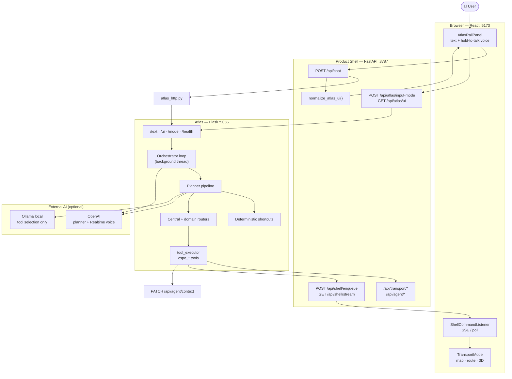
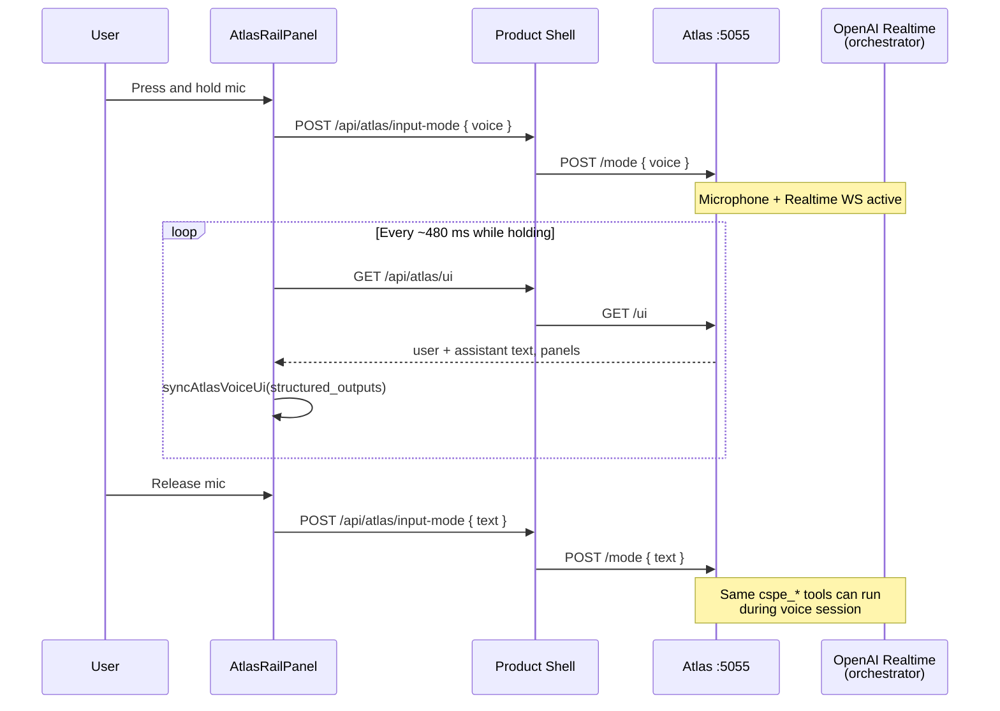
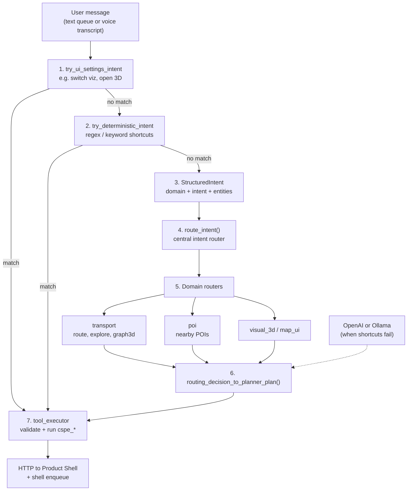
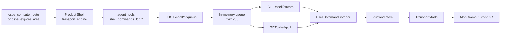
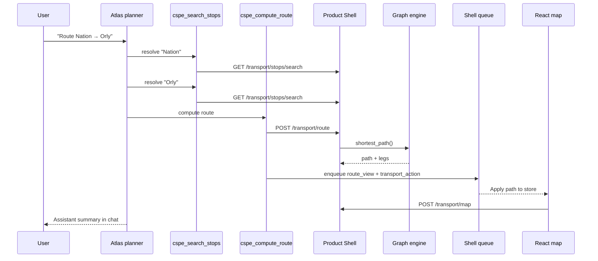

# Atlas AI Agent — How It Works (Diagrams for Presentation)

This document explains **how Atlas actually works** in CSPE, with Mermaid diagrams for PowerPoint. It is based on verified integration code (`atlas_http.py`, `chat.py`, `AtlasRailPanel.tsx`, `ShellCommandListener.tsx`, `agent_tools.py`) and Atlas router tests (`tests/test_intent_routing.py`). The full Atlas Python tree lives under `src/work/atlas/` (Flask **:5055**).

---

## In one sentence

**Atlas is not the map.** It is a separate AI service that **understands natural language**, **chooses tools**, **calls the same Product Shell API** as the manual UI, and **pushes UI updates** through a shell command queue — then **replies** in chat or voice.

---

## What Atlas is responsible for

| Atlas does | Atlas does **not** |
|------------|-------------------|
| Interpret text / voice | Read GTFS files |
| Route intents to tools | Compute shortest paths itself |
| Call `http://127.0.0.1:8787/api/...` | Render Mapbox HTML |
| Enqueue shell commands for React | Draw the 3D graph directly |
| Produce assistant replies (OpenAI Realtime for voice) | Replace the transport engine |

**No custom model was trained** in this project. Atlas uses **prompting + tool schemas + shortcuts**, with **OpenAI** (and optionally **Ollama** for local tool selection).

---

## Diagram 1 — Global Atlas architecture



**Ports:** Atlas **5055**, Product Shell **8787**, Frontend **5173**.

---

## Diagram 2 — Text chat: full turn (step by step)

```mermaid
sequenceDiagram
  participant U as User
  participant UI as AtlasRailPanel
  participant BFF as Product Shell<br/>POST /api/chat
  participant AH as atlas_http.py
  participant A as Atlas Flask<br/>:5055
  participant P as Planner + tools
  participant PS as Product Shell APIs<br/>:8787
  participant Shell as Shell queue
  participant TM as TransportMode

  U->>UI: Type message, Send
  UI->>BFF: POST /api/chat { message }
  BFF->>AH: send_text_and_wait()
  AH->>A: POST /mode { text }
  AH->>A: GET /ui (snapshot before)
  AH->>A: POST /text { text: message }
  Note over A: Message queued for orchestrator

  A->>P: Planner turn
  alt Fast shortcut (&lt;200 ms)
    P->>P: try_ui_settings / deterministic intent
  else LLM planner
    P->>P: route_intent → domain router
    P->>P: OpenAI or Ollama picks tool + args
  end

  P->>PS: HTTP cspe_* tools<br/>(route, explore, search…)
  P->>Shell: POST /shell/enqueue<br/>(UI commands)
  P->>PS: PATCH /agent/context

  loop Poll until settled (~0.45 s)
    AH->>A: GET /ui
  end

  AH-->>BFF: Atlas /ui JSON
  BFF->>BFF: normalize_atlas_ui()
  BFF-->>UI: structured_outputs + assistant text
  UI->>UI: Append chat bubbles

  Shell-->>TM: transport_route_view,<br/>exploration_view, etc.
  TM->>PS: POST /transport/map …
  TM->>TM: Update map / route display
```

**Key idea:** the user sees one chat reply, but Atlas may have already run **several backend calls** and **shell commands** before `/ui` stabilizes.

---

## Diagram 3 — Voice mode (hold-to-talk)



Voice **does not** bypass the Product Shell: tools still hit `:8787`. The frontend **polls** `/api/atlas/ui` instead of using `POST /api/chat` per utterance.

---

## Diagram 4 — Inside Atlas: from words to tools

Based on `tests/test_intent_routing.py` and `docs/LOCAL_PLANNER.md`.



**Latency strategy:**

| Path | Typical time |
|------|----------------|
| Deterministic shortcut | &lt; 200 ms |
| Local Ollama 3B | 1–5 s |
| OpenAI planner | 1.5–4+ s |

Env: `ATLAS_PLANNER_BACKEND=openai | auto | local` (see `docs/LOCAL_PLANNER.md`).

---

## Diagram 5 — How Atlas updates the map (without touching the DOM)

Atlas never manipulates React. It enqueues **shell commands**; the browser applies them.



### Example shell commands after a route

| Command kind | Effect on UI |
|--------------|--------------|
| `set_mode` | Ensure transport mode |
| `atlas_transport_action` | Fill route fields, dock tab, graph mode |
| `transport_route_view` | Path IDs, legs, meta, errors |
| `transport_exploration_view` | Nearby stops/POIs for map overlay |
| `transport_graph3d_sync` | Switch to embedded GraphXR + enable sync |
| `transport_options` | Change viz, LCC, graph_viz |

Built in `backend/product_shell/services/agent_tools.py` (`shell_commands_for_route`, `shell_commands_for_exploration`).

---

## Main CSPE tools (what Atlas can call)

Verified in tests and integration (names start with `cspe_`):

| Tool | Purpose |
|------|---------|
| `cspe_compute_route` | Resolve stops + route + shell sync |
| `cspe_search_stops` | Autocomplete / resolve place names |
| `cspe_explore_area` | Combined area exploration + map sync |
| `cspe_nearby_stops` | Stops in radius |
| `cspe_nearby_pois` | POIs in radius (local index) |
| `cspe_filter_visible_results` | Filter last exploration on map |
| `cspe_open_graph3d` | Open / sync 3D graph view |
| `cspe_transport_action` | Partial UI spec (mode, dock, run) |
| `cspe_transport_options` | LCC, viz, graph_viz |
| `cspe_get_current_context` | Read transport state from BFF |
| `cspe_lookup_place_online` | Station/POI info (IDFM or web — chat) |
| `cspe_show_station_or_line_info` | Routed to lookup when needed |

Tools execute **HTTP requests** to `PRODUCT_SHELL_URL` (default `http://127.0.0.1:8787`).

---

## Diagram 6 — Example: “Route from Nation to Orly”



Same route logic as **manual UI** — Atlas is a **controller**, not a separate router.

---

## Text vs voice vs manual UI

| | Text chat | Voice | Manual UI |
|--|-----------|-------|-----------|
| **Trigger** | Send in rail | Hold mic | Route dock / buttons |
| **Frontend entry** | `POST /api/chat` | `POST /api/atlas/input-mode` + poll `/api/atlas/ui` | Direct `/api/transport/*` |
| **Atlas** | `/text` queue → planner | Realtime + same tools | Not used |
| **Map update** | Shell commands | Shell commands | Local state + API |
| **Reply** | Chat bubble | Spoken + live text | No chat |

---

## Agent context (memory for follow-ups)

`AgentContextSync.tsx` sends transport state to `PATCH /api/agent/context`. Atlas tools read it via `cspe_get_current_context`. Router context in Atlas (`session_state.py`) also tracks:

- `last_tool`, `last_tool_args`
- `last_exploration`, `last_place_lookup`
- `last_cspe_transport` (last route queries)

This enables follow-ups like “show restaurants **there**” after a station question.

---

## Files that matter (integration layer)

| File | Role |
|------|------|
| `frontend/src/components/AtlasRailPanel.tsx` | Chat UI + voice hold |
| `frontend/src/hooks/useAtlasTextChat.ts` | `POST /api/chat` |
| `frontend/src/components/ShellCommandListener.tsx` | Apply Atlas UI commands |
| `backend/product_shell/routers/chat.py` | Chat endpoint |
| `backend/product_shell/routers/atlas.py` | Voice/text mode proxy |
| `backend/product_shell/services/atlas_http.py` | Atlas HTTP + poll until settled |
| `backend/product_shell/services/normalize.py` | `/ui` → chat blocks |
| `backend/product_shell/services/agent_tools.py` | Route/explore + shell builders |
| `backend/product_shell/routers/shell.py` | Command queue + SSE |
| `src/work/atlas/...` | Planner, orchestrator, tool_executor (Flask app) |
| `tests/test_intent_routing.py` | Intent → tool mapping tests |

---

## What to say on the slide (oral script)

> « Atlas est un **agent séparé** sur le port 5055. Quand l’utilisateur écrit ou parle, Atlas **comprend l’intention**, choisit un **outil** (`cspe_compute_route`, `cspe_explore_area`, etc.), et appelle notre **backend FastAPI** — le même que l’interface manuelle. Pour mettre à jour la carte, Atlas n’envoie pas de HTML : il envoie des **commandes shell** que le frontend React consomme. La réponse visible dans le chat vient du polling de l’API Atlas `/ui`, après exécution des outils. On n’a **pas entraîné** de modèle : on utilise OpenAI (et optionnellement Ollama en local) avec des **outils décrits en JSON**. »

---

## Common mistakes to avoid

- ❌ « Atlas calcule le plus court chemin dans le LLM » → **NetworkX** on the server graph.
- ❌ « Atlas génère la carte Mapbox » → **plot_mapbox.py** on Product Shell.
- ❌ « C’est un chatbot séparé du projet » → it **drives** the same transport app via API + shell queue.
- ❌ « On a fine-tuné un modèle transport » → **prompting + tools only**.

---

## Export for PowerPoint

| Slide suggestion | Diagram to use |
|------------------|----------------|
| Atlas overview | **Diagram 1** |
| One text message end-to-end | **Diagram 2** |
| Voice | **Diagram 3** |
| Planner internals (technical backup) | **Diagram 4** |
| How map updates | **Diagram 5** |
| Concrete route example | **Diagram 6** |

Copy Mermaid blocks into [mermaid.live](https://mermaid.live) → export PNG/SVG.

---

## Uncertainty note

The Atlas implementation files (`tool_executor.py`, `orchestrator.py`, `run_api.py`, etc.) are expected under `src/work/atlas/src/atlas_client/` but may be **missing from a minimal git checkout**. Behavior above is confirmed from **Product Shell integration**, **frontend**, and **pytest intent tests**. Verify Atlas starts with `run_web_app.ps1` before demo.

---

*Companion doc: `docs/backend_api_slide_diagram.md` (Product Shell / API layer).*
