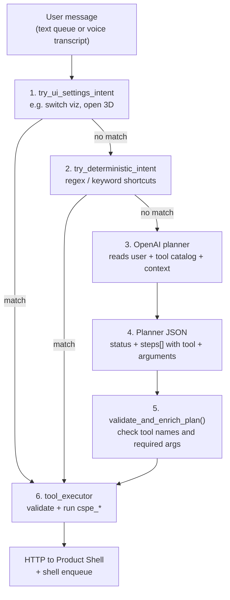

# Atlas Planner — Direct OpenAI Tool Selection (Diagram)

Simplified view of how Atlas turns a user message into a **concrete `cspe_*` tool call**.  
This diagram shows the **OpenAI planner path**: the model picks the tool and arguments directly — no domain router step.

---

## In one sentence

**Fast shortcuts first; if none match, OpenAI returns a JSON plan with the tool name and arguments; the executor validates and runs it on the Product Shell.**

---

## Diagram — From words to tools



---

## What OpenAI outputs (example)

User: *« Show me the route from Nation to Aéroport d'Orly »*

OpenAI returns **one JSON object** with the tool already chosen:

```json
{
  "status": "continue",
  "steps": [
    {
      "tool": "cspe_compute_route",
      "arguments": {
        "from_query": "Nation",
        "to_query": "Aéroport d'Orly",
        "mode": "all",
        "sync_ui": true
      },
      "reason": "User asked for a route between two stations"
    }
  ],
  "tool_name": null,
  "args": {},
  "clarifying_question": "",
  "final_summary": "",
  "topic": "transport"
}
```

The planner does **not** output `domain` / `intent` — it names the tool (`cspe_compute_route`) and fills its arguments.

---

## Step-by-step (for oral defense)

| Step | What happens |
|------|----------------|
| **1–2** | Cheap local checks for obvious UI commands or fixed phrases → go straight to `tool_executor` if matched. |
| **3** | OpenAI receives the user text, allowed tools catalog, router context, and world state (`agent_planner.py` → `_plan_next_step_openai`). |
| **4** | Model returns structured JSON: `status`, optional `steps[]` with `tool` + `arguments`. |
| **5** | Python validates tool names against `tools_registry.json` and applies defaults. |
| **6** | `tool_executor` runs the tool → HTTP calls to Product Shell `:8787` and shell commands for the React UI. |

---

## Latency strategy

| Path | Typical time |
|------|----------------|
| UI / deterministic shortcut | &lt; 200 ms |
| OpenAI planner (natural language) | ~1–3 s |

---

## One sentence for the slide (FR)

> « Si aucun raccourci ne correspond, **OpenAI choisit directement l’outil CSPE** (`cspe_compute_route`, `cspe_nearby_pois`, …) et ses arguments en JSON ; le **tool_executor** valide et exécute l’appel sur le Product Shell. »

---

## Code references

| Piece | File |
|-------|------|
| Planner system prompt + OpenAI call | `src/work/atlas/src/atlas_client/core/agent_planner.py` |
| Tool schemas | `src/work/atlas/src/atlas_client/router/tools_registry.json` |
| Validation + execution | `src/work/atlas/src/atlas_client/router/tool_executor.py` |
| Product Shell HTTP bridge | `backend/product_shell/services/agent_tools.py` |
