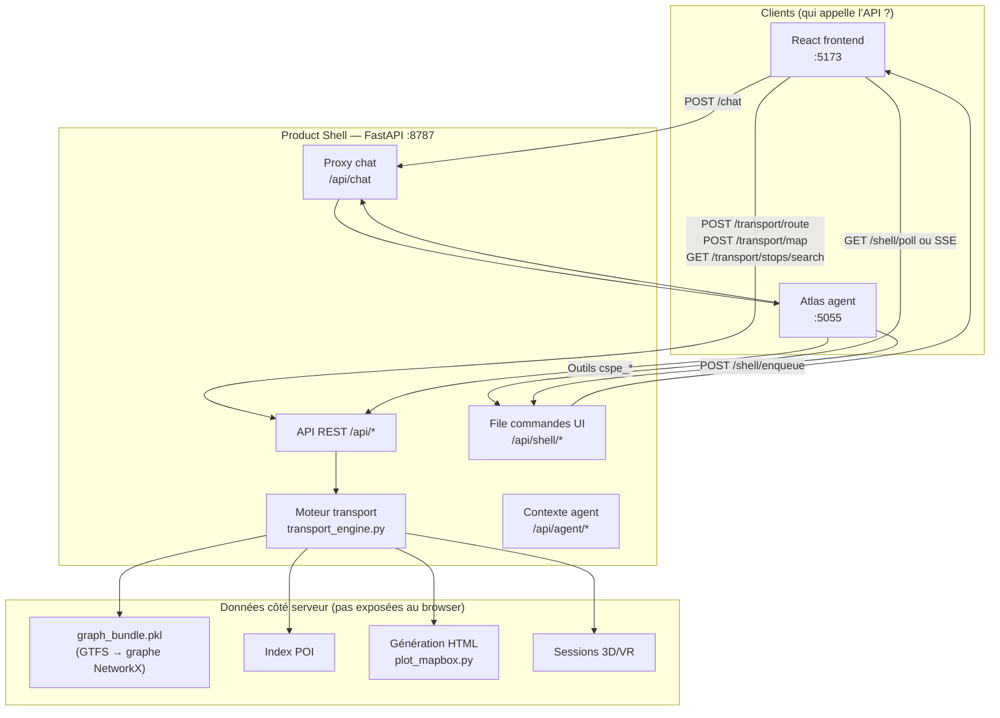
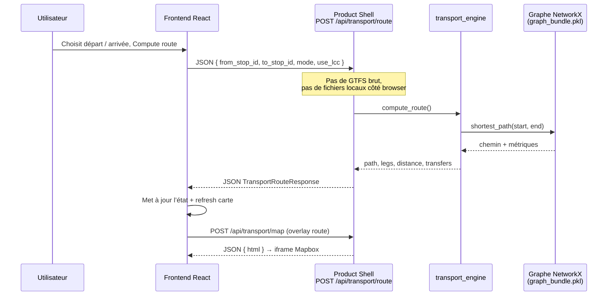
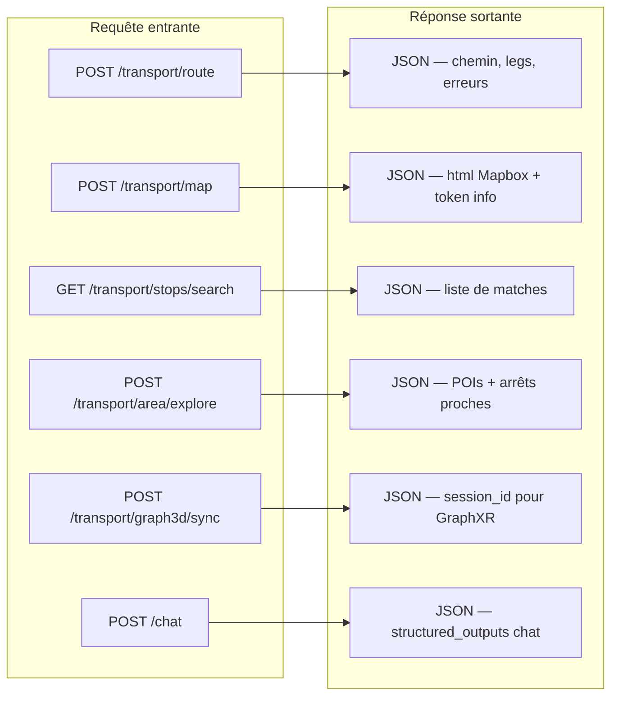

# Slide 6 — Backend et API (Product Shell)

Document pour la présentation : validation du texte de la slide, schéma Mermaid, et points de précision basés sur le code (`backend/product_shell/`).

---

## Votre texte est-il correct ?

**Oui, dans l’ensemble.** La slide décrit bien le rôle du backend. Quelques nuances utiles pour la soutenance :

| Affirmation dans votre slide | Verdict | Précision |
|------------------------------|---------|-----------|
| Backend = FastAPI | ✅ Correct | Application `backend/product_shell/main.py`, port **8787** (`run_web_app.ps1`) |
| Point central entre UI, Atlas, données, visualisations | ✅ Correct | On appelle ce serveur le **Product Shell** (couche BFF) |
| Le frontend n’accède pas directement au GTFS / graphe | ✅ Correct | Tout passe par `/api/transport/*` ; le graphe est dans `graph_bundle.pkl`, chargé côté serveur |
| Requête POST avec départ, arrivée, mode, options viz | ⚠️ Presque | **Route** : `POST /api/transport/route` → IDs d’**arrêts** ou de **stations** + `mode` + `use_lcc` (pas les options de carte). **Carte** : `POST /api/transport/map` → mode, viz, chemins, sélection, etc. |
| Backend appelle le moteur transport | ✅ Correct | `transport_engine.py` |
| Réponse JSON ou HTML Mapbox | ✅ Correct | Route = JSON ; carte = JSON contenant `{ html: "..." }` pour l’iframe |
| Atlas utilise les mêmes APIs | ✅ Correct | Outils `cspe_*` → HTTP vers `:8787` ; parfois + **file de commandes shell** pour synchroniser l’UI |
| Backend = orchestration technique | ✅ Correct | Atlas (:5055) planifie ; le Product Shell **exécute** transport + sert l’UI |

**Phrase oral recommandée (plus précise) :**

> « Le frontend et Atlas ne lisent jamais les fichiers GTFS. Ils appellent le **Product Shell FastAPI**, qui charge le graphe pré-calculé et renvoie soit du **JSON** (route, recherche, exploration), soit du **HTML Mapbox** pour la carte, soit une **session 3D** pour GraphXR. »

---

## Schéma 1 — Rôle du backend (vue slide)

**Idée clé pour la slide :** une seule porte d’entrée technique (`:8787`) pour la logique métier transport.

---

## Schéma 2 — Exemple : demande de route

Même enchaînement si la demande vient **d’Atlas** : Atlas appelle d’abord la route côté serveur, puis envoie des **commandes shell** pour que le frontend affiche le même résultat.

---

## Schéma 3 — Types de réponses API

Le frontend **n’interprète pas le GTFS** : il consomme ces réponses déjà structurées.

---

## Principaux endpoints (référence slide / annexe)

| Endpoint | Méthode | Entrée (résumé) | Sortie |
|----------|---------|-----------------|--------|
| `/api/transport/route` | POST | `from_stop_id` / `to_stop_id` ou stations, `mode`, `use_lcc` | JSON route |
| `/api/transport/map` | POST | mode, `viz_mode`, paths, sélection, graph_viz | JSON `{ html }` |
| `/api/transport/stops/search` | GET | query, mode | JSON liste |
| `/api/transport/area/explore` | POST | centre, rayon, catégorie POI | JSON exploration |
| `/api/transport/graph3d/sync` | POST | état vue + fingerprint | JSON session 3D |
| `/api/shell/enqueue` | POST | commandes UI | ack (Atlas → frontend) |
| `/api/chat` | POST | message utilisateur | JSON chat structuré |
| `/api/agent/context` | GET/PATCH | état transport | JSON (pour Atlas) |

Fichiers : `routers/transport.py`, `routers/shell.py`, `routers/chat.py`, `routers/agent.py`.

---

## Pourquoi une API (arguments pour l’oral)

1. **Séparation des responsabilités** — React affiche ; Python calcule sur le graphe.
2. **Un seul moteur** — UI manuelle et Atlas partagent `transport_engine`.
3. **Sécurité / config** — token Mapbox et clés IDFM restent côté serveur.
4. **Performance** — graphe lourd chargé une fois en mémoire (`warmup.py`), pas dans le navigateur.
5. **Évolutivité** — on peut changer le graphe ou l’algo sans refaire tout le frontend.

---

## Ce qu’il ne faut pas dire par erreur

- ❌ « Le backend lit les fichiers GTFS à chaque requête » → le graphe est **pré-construit** (`scripts/rebuild_routing_bundle.py` → `graph_bundle.pkl`).
- ❌ « Une seule requête POST contient route + carte + 3D » → ce sont des **appels séparés** (route JSON, puis map HTML, puis graph3d session si besoin).
- ❌ « Atlas génère le HTML Mapbox » → Atlas déclenche le backend ; **plot_mapbox.py** génère le HTML.

---

## Export pour PowerPoint

1. Copier **Schéma 1** ou **Schéma 2** dans [Mermaid Live Editor](https://mermaid.live).
2. Exporter en PNG/SVG pour la slide 6.
3. Garder le tableau des endpoints en **annexe** ou slide suivante si le jury veut du détail.

---

*Basé sur `backend/product_shell/main.py`, `routers/transport.py`, `schemas.py`, `transport_engine.py`.*
