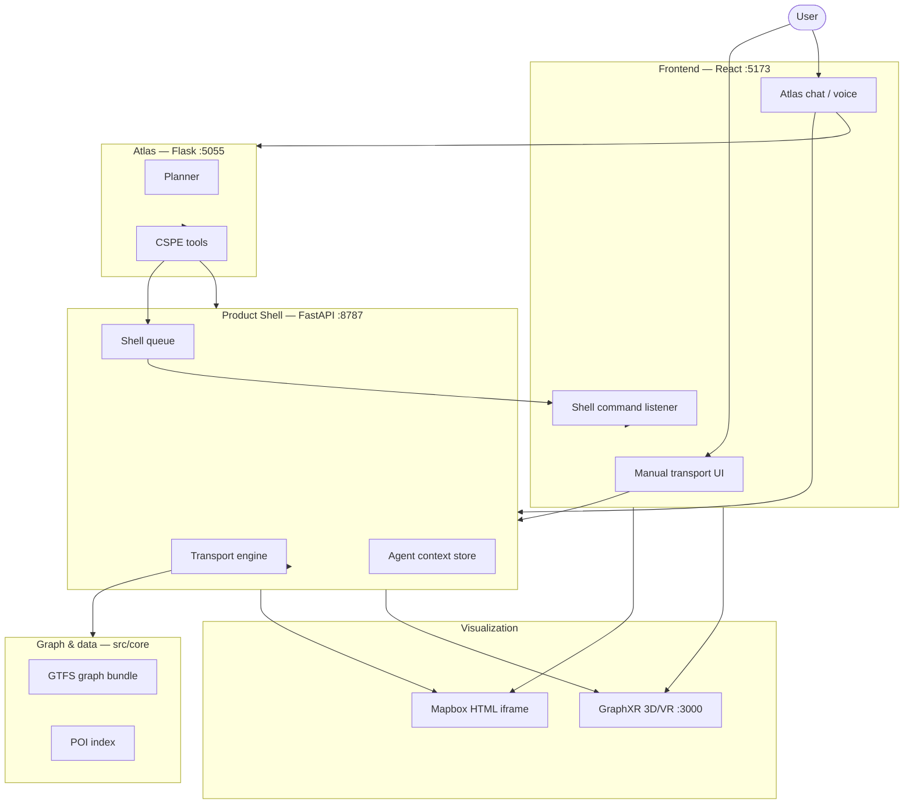

# CSPE — Full Project Explanation (Presentation & Defense)

This document explains the **CSPE** project end to end, based on inspection of the repository: source code, launch scripts, tests, and existing docs. It is written for preparing a PowerPoint and an oral defense.

**Language:** clear English with occasional French terms where they match the UI or domain (e.g. *trajet*, *gare*).

**Honesty rule:** features are labeled **implemented**, **partial**, **experimental**, or **not present** — not invented.

---

## Uncertainty note (read first)

During this audit, **`src/work/atlas/` contains almost no Python source** in the workspace checkout (only `session_state.py` was found). Tests, `run_web_app.ps1`, and integration code reference a full Atlas tree (`run_api.py`, `tool_executor.py`, `orchestrator.py`, etc.). The Atlas sections below are therefore based on **integration points** (`backend/product_shell/services/atlas_http.py`), **tests** (`tests/test_intent_routing.py`), and **docs** (`docs/LOCAL_PLANNER.md`). If your machine runs Atlas successfully, the missing files may live outside git tracking or in a local install.

Similarly, **`data/derived/`** may be gitignored; the bundle must exist on disk for routing to work (`scripts/rebuild_routing_bundle.py`).

---

# 1. Project overview

## What CSPE is

**CSPE** (Combined Spatial Product Environment) is a **local full-stack web application** for exploring **Île-de-France public transport** (GTFS-style data). It combines:

1. A **transport graph engine** (build routes on a real multimodal network),
2. **Interactive visualizations** (Mapbox 2D map + optional 3D/VR network graph),
3. An **AI assistant called Atlas** that can control the same features through natural language (text or voice).

The user-facing product today is **transport-focused**: one main screen with a map area and an Atlas panel on the right.

## What problem it tries to solve

Public transport data is complex: many modes (metro, RER, tram, bus), many stops per station, transfers, and geographic context (POIs near a station). CSPE tries to make this usable in one place:

- **Find a route** between two places on the network.
- **Explore** what is around a station (stops, restaurants, etc.).
- **See results visually** on a map or in 3D/VR — not only as text.

## Final user experience (intended)

A user opens the web app (`http://127.0.0.1:5173` in dev), sees a **full-screen transport map**, and can either:

- Use the **manual UI** (route dock, search, mode filters), or
- Talk/type to **Atlas** (“Route me from Nation to Orly”, “Show restaurants near Châtelet”).

The map updates with **routes**, **exploration markers**, or **selection highlights**. Optionally, the user opens **3D/VR graph** mode to walk/fly through the network graph (GraphXR viewer).

## Why combine AI + transport graph + visualization

| Piece | Role |
|-------|------|
| **Transport graph** | Ground truth: same routing whether human or AI asks |
| **Visualization** | Makes spatial results understandable |
| **Atlas** | Lowers the barrier: natural language instead of clicking through forms |

Atlas is **not** a separate fake map — it calls the **same backend APIs** and pushes **shell commands** that the React app already understands. That keeps AI actions **testable and reproducible**.

---

# 2. Main user scenarios

Each scenario: **user input → processing → visual output**.

## Scenario A — Ask Atlas for a route

| Step | Detail |
|------|--------|
| **User input** | Text in Atlas rail: e.g. “Find a route from Nation to Aéroport d’Orly” |
| **Processing** | `POST /api/chat` → Atlas planner → tools `cspe_search_stops` + `cspe_compute_route` → `POST /api/transport/route` on graph bundle → shell commands enqueued |
| **Visual output** | Map iframe refreshed with **route overlay**; route legs shown in dock; Atlas summarizes in chat |

**Status:** **Implemented** (requires Atlas running on :5055).

## Scenario B — Search stations/stops (manual or Atlas)

| Step | Detail |
|------|--------|
| **User input** | Type in route dock autocomplete or Atlas search tool |
| **Processing** | `GET /api/transport/stops/search` → `transport_engine.search_stops()` → graph node names + station grouping |
| **Visual output** | Suggestion list; selecting a stop can highlight it on the map |

**Status:** **Implemented**.

## Scenario C — POIs around a station

| Step | Detail |
|------|--------|
| **User input** | Atlas: “Restaurants near Châtelet” or exploration command |
| **Processing** | Resolve center stop/station → `POST /api/transport/area/explore` → POI BallTree lookup + nearby stops → optional `sync_ui` shell commands |
| **Visual output** | Exploration overlay on map; exploration panel in chat with counts and summary |

**Status:** **Implemented** (POIs from local OSM-derived index, not live web search for map sync).

## Scenario D — Manual transport UI (no Atlas)

| Step | Detail |
|------|--------|
| **User input** | Route dock: start/end fields, Compute route; or Search tab for stop lookup |
| **Processing** | Direct `POST /api/transport/route` or map refresh from frontend state |
| **Visual output** | Same map/route display as Atlas path, without chat turn |

**Status:** **Implemented**.

## Scenario E — Geographic Mapbox map

| Step | Detail |
|------|--------|
| **User input** | “Geographic” viz button (default) |
| **Processing** | `POST /api/transport/map` → server generates Mapbox GL HTML from view state |
| **Visual output** | Full-screen iframe with Île-de-France map, stops/stations, optional route path |

**Status:** **Implemented** (requires `MAPBOX_TOKEN` in `.env`).

## Scenario F — 3D Mapbox (pitched map, not VR graph)

| Step | Detail |
|------|--------|
| **User input** | “3D map” button (`network_3d` viz mode) |
| **Processing** | Same map endpoint with pitched Mapbox view + 3D buildings where configured |
| **Visual output** | Mapbox iframe with camera pitch — **still Mapbox**, not GraphXR |

**Status:** **Implemented**.

## Scenario G — 3D/VR network graph (GraphXR)

| Step | Detail |
|------|--------|
| **User input** | “3D/VR graph” button or Atlas `cspe_open_graph3d` / `transport_graph3d_sync` |
| **Processing** | `POST /api/transport/graph3d/sync` → session JSON built from graph + route highlight → embedded iframe `viewers/graphxr` with `embedded=1` |
| **Visual output** | Full-screen Babylon.js graph; route nodes/edges orange; VR button for headset |

**Status:** **Implemented** (embedded same-page mode; GraphXR dev server on :3000).

## Scenario H — Voice with Atlas

| Step | Detail |
|------|--------|
| **User input** | Hold-to-talk in Atlas rail |
| **Processing** | `POST /api/atlas/input-mode` `{mode:"voice"}` → Atlas orchestrator (OpenAI Realtime, per architecture) → same tools as text |
| **Visual output** | Map/shell updates as tools run; voice reply via Atlas UI polling |

**Status:** **Implemented** at integration level; orchestrator source not verified in this checkout.

## Scenario I — Station info / IDFM enrichment (chat)

| Step | Detail |
|------|--------|
| **User input** | Atlas asks about accessibility, departures, service hours |
| **Processing** | `POST /api/agent/transport/place-lookup` → local stop resolution first → IDFM Navitia API enrichment |
| **Visual output** | **Chat text only** — does not move the map by design |

**Status:** **Implemented** for chat enrichment (`IDFM_API_KEY` optional).

## Scenario J — Map focus mode

| Step | Detail |
|------|--------|
| **User input** | Press **F** (when not typing in an input) |
| **Processing** | Toggles `transportMapChromeHidden` in Zustand store |
| **Visual output** | Hides transport HUD; shows slim Atlas focus bar |

**Status:** **Implemented**.

---

# 3. Global architecture

## Simple explanation

## Layers

| Layer | Technology | Role |
|-------|------------|------|
| **Frontend** | React 19, Vite, Zustand | UI, map iframe, GraphXR iframe, state |
| **Product shell** | FastAPI, uvicorn :8787 | BFF: transport, chat proxy, shell queue, agent context |
| **Atlas** | Flask :5055 | NL planning, tool execution, voice orchestration |
| **Graph engine** | Python, NetworkX, pandas | GTFS → graphs, routing, search |
| **Visualization** | Mapbox GL (server HTML), GraphXR (Next.js + Babylon.js) | 2D/3D map and network 3D/VR |
| **External APIs** | Mapbox, IDFM Navitia PRIM, OpenAI, optional Ollama, optional SerpAPI | Tokens, enrichment, planner, place lookup |
| **Data** | GTFS files, derived pickle/parquet, OSM POIs | Offline network + POI index |

---

# 4. Frontend explanation

## Framework and role

- **React 19 + TypeScript + Vite** (`frontend/`)
- Dev server: **:5173**, proxies `/api` → product shell **:8787** (`vite.config.ts`)
- Single route: `/` → `AppShell` (`frontend/src/App.tsx`)

## Main UI components

| Component | File | Role |
|-----------|------|------|
| **AppShell** | `components/AppShell.tsx` | Layout: TransportMode + AtlasRailPanel; hides rail in graph3d fullscreen |
| **TransportMode** | `modes/TransportMode.tsx` | Map, route dock, exploration, graph3d iframe (~1400 lines) |
| **AtlasRailPanel** | `components/AtlasRailPanel.tsx` | Chat input, voice hold, exploration turns |
| **ShellCommandListener** | `components/ShellCommandListener.tsx` | Applies Atlas shell commands to store |
| **AgentContextSync** | `components/AgentContextSync.tsx` | PATCH transport state to backend for planner |
| **MapFocusHotkey** | `components/MapFocusHotkey.tsx` | `F` toggles chrome hidden |

**Removed from current tree:** `VisualBoardMode`, `MusicMode`, `ToolRail` multi-mode navigation — store only supports `mode: "transport"`.

## Transport interface

- **Left stack:** graph mode (all/metro/rail/…), viz (geographic / 3D map / 3D VR graph), graph layer (stops/stations/both), LCC toggle, refresh
- **Bottom dock:** Route tab (start/end, compute) and Search tab (stop lookup)
- **Map area:** Mapbox iframe **or** GraphXR iframe when `transportViz === "graph3d"`
- **Map refresh:** `transport/mapRefreshScheduler.ts` coalesces overlapping `POST /api/transport/map` calls

## Atlas panel (text + voice)

- **Text:** `useAtlasTextChat.ts` → `POST /api/chat` → updates `chatHistory` and structured outputs
- **Voice:** hold button → `POST /api/atlas/input-mode` `{voice}` → poll `GET /api/atlas/ui` every ~480 ms → release returns to text mode

## Backend communication

All HTTP via `frontend/src/api/client.ts` and `api/config.ts` (`VITE_API_BASE`, `VITE_GRAPHXR_VIEWER_URL`).

## UI state (Zustand)

Central store: `frontend/src/store.ts`

Important fields: `transportGraphMode`, `transportUseLcc`, `transportViz`, `transportGraphViz`, path IDs, route legs/errors, `transportExploration`, `atlasTransportActions` queue, `chatHistory`, `transportMapChromeHidden`.

## Manual vs Atlas-triggered actions

| Aspect | Manual UI | Atlas |
|--------|-----------|-------|
| Route | User clicks Compute → `postRoute()` | Tool → backend route → **shell commands** |
| Map update | Direct state change → map scheduler | Shell command → same scheduler |
| Exploration | Could be manual search; mainly Atlas-driven | `transport_exploration_view` + `atlas_transport_action` |

Shared logic: **same transport API** and **same map refresh pipeline** once state is updated.

---

# 5. Backend explanation

## Framework and role

- **FastAPI** application: `backend/product_shell/main.py`
- Runs on **:8787** via uvicorn
- Loads repo `.env` (Mapbox, IDFM keys)
- CORS enabled for localhost, LAN, and GraphXR origin

## Product shell concept

The **product shell** is the **single backend for the React app**. It:

- Executes transport logic (no separate “routing microservice” in current tree)
- Proxies Atlas chat/voice
- Holds an in-memory **shell command queue** for UI sync
- Stores **agent context** for planner tools

Older architectures (separate `cspe_api`, Streamlit) are **removed** (see Archive/docs history).

## Routers and endpoints

| Router | Prefix | Main endpoints |
|--------|--------|----------------|
| `routers/chat.py` | `/api` | `POST /chat` |
| `routers/atlas.py` | `/api` | `POST /atlas/input-mode`, `GET /atlas/ui` |
| `routers/shell.py` | `/api` | `POST /shell/enqueue`, `GET /shell/poll`, `GET /shell/stream` (SSE) |
| `routers/agent.py` | `/api` | `GET/PATCH /agent/context`, `POST /agent/events`, `POST /agent/transport/route`, place lookup |
| `routers/transport.py` | `/api` | Map, route, search, exploration, graph3d, stats |

## Key backend files

| File | Responsibility |
|------|----------------|
| `transport_engine.py` | Graph bundle load, map HTML, routing, graph3d sessions, caches |
| `transport_exploration.py` | Area explore, nearby stops/POIs, filters |
| `services/agent_tools.py` | Server-side route resolution, shell command builders |
| `services/atlas_http.py` | HTTP to Atlas :5055, poll `/ui` until settled |
| `services/normalize.py` | Atlas UI → structured chat blocks |
| `services/warmup.py` | Background preload on startup |
| `services/idfm_*.py` | IDFM Navitia enrichment (stations only) |

## Processing flow (typical request)

1. FastAPI router receives JSON
2. Handler calls `transport_engine` or `agent_tools`
3. Engine loads **cached** `graph_bundle.pkl` (not rebuilt per request)
4. Result returned as JSON — or shell commands enqueued for browser
5. Map HTML may come from memory/disk cache (`data/derived/product_shell/map_html_cache/`)

---

# 6. Transport graph and data processing

This section explains the **technical core** of the project.

## Data sources

| Source | Path / API | Used for |
|--------|------------|----------|
| **GTFS** | `data/gtfs/` | Stops, routes, trips, stop_times, transfers |
| **Graph bundle** | `data/derived/routing/graph_bundle.pkl` | Prebuilt NetworkX graphs (required) |
| **Stop popup index** | `data/derived/stops/stop_popup_index.parquet` | Lines, modes per stop |
| **Line geometry** | `data/derived/maps/` | Map rendering |
| **Render graphs** | `data/derived/render_graphs/*.json` | Network layout metadata |
| **POIs** | `data/normalized/poi/poi.parquet` + `data/derived/indexes/poi_balltree.*` | Nearby POI search |
| **IDFM static** | `data/derived/idfm/*.csv` | Referential/accessibility data |
| **IDFM live** | Navitia PRIM API | Departures, service hours (enrichment only) |

Rebuild: `scripts/rebuild_routing_bundle.py` (bundle version **5** in `cache_bundle.py`).

## GTFS loading

`src/core/graph_loader.py` → `load_gtfs()` reads standard GTFS CSVs into pandas DataFrames.

## Stops and stations

- **Stop** = one GTFS `stop_id` (platform/quay level) → **graph node**
- **Station** = group of stops via `src/core/station_layer.py`:
  - GTFS `parent_station` when available
  - Transfer connectivity
  - Same normalized name within **260 m**
- **Routing** runs on **stop graph**; station path is **derived** for display and station-first search

## Nodes and edges

Graphs are **NetworkX** `Graph` objects (undirected), one per mode filter: `all`, `metro`, `rail`, `tram`, `bus`, `other`, plus **LCC** (largest connected component) variants.

### Ride edges

- Connect **consecutive stops** on the same GTFS trip (`stop_times`)
- `edge_kind = "ride"`
- Attributes: `mode`, route ids/labels, `distance_m`, `time_s`, `cost`, `weight_m`
- Time estimated from distance / mode speed if not in GTFS

### Transfer edges

Two sources:

1. **GTFS transfers** (`transfers.txt`) — `edge_kind = "transfer"`, respects `min_transfer_time`, skips forbidden transfers
2. **Inferred transfers** — same station name within **400 m**, or nearby stops within **200 m**, with **180 s** penalty added to cost

### Edge attributes (summary)

| Attribute | Meaning |
|-----------|---------|
| `edge_kind` | `"ride"` or `"transfer"` |
| `mode` / `modes` | Transport mode(s) |
| `distance_m`, `weight_m` | Geographic length |
| `time_s`, `cost` | Time cost (transfers penalized) |
| `route_ids`, `route_labels` | Line identity for legs display |

## Routing algorithm

**Library:** NetworkX (`src/core/queries.py`)

**Path finding:** `nx.shortest_path(G, a, b)` — **unweighted, minimum hop count**

**Important honesty:** edges store time and cost, and `summarize_path()` **sums distance, time, and transfer count along the chosen path** — but the **path itself is not time-optimal** today. Parameters `strategy` and `use_weights` exist in the API but are **ignored** (forced to `"hops"`). This is a known limitation (see §15–16).

**Station routing:** `compute_route_stations()` tries stop pairs between station member sets and picks best result.

**Output:** stop path, station path, legs (`path_legs.py`), distance/time/transfers summary, error reasons (`not_connected`, etc.).

## POI integration

`src/core/poi_index.py` — BallTree on haversine distance over `poi.parquet`.

Used by `transport_exploration.py` for categories: restaurant, cafe, museum, park, etc. **Not** used for GTFS routing.

## External data

- **IDFM:** station enrichment after **local** graph resolution — not for routing graph
- **SerpAPI** (optional): web query building in place lookup — chat-oriented

---

# 7. Atlas AI agent

## What Atlas is responsible for

- Interpreting **natural language** (text and voice)
- Choosing **which tool to call** with which arguments
- Calling the **product shell** (transport APIs + shell enqueue + agent context)
- Producing **assistant replies** (OpenAI Realtime for voice; text via planner pipeline)

Atlas does **not** compute shortest paths itself — it delegates to CSPE backend tools.

## How text is interpreted

1. User message → product shell `POST /api/chat`
2. `atlas_http.send_text_and_wait()` → Atlas `POST /text`
3. Background session runs **planner turn** (shortcuts → domain router → tool plan)
4. `tool_executor` runs each `cspe_*` tool
5. Product shell polls Atlas `GET /ui` until UI payload stable
6. `normalize_atlas_ui()` → structured outputs for React chat

## How voice works (integration level)

1. `AtlasRailPanel` sets mode `voice` via `POST /api/atlas/input-mode`
2. Polls `GET /api/atlas/ui` while holding mic
3. Orchestrator uses **OpenAI Realtime WebSocket** (per docs; source not in checkout)
4. Same tools as text after planner decisions

## Tools and intents

Tools are registered in Atlas (`tools_registry.json` — referenced in docs/tests). Examples verified in tests and docs:

`cspe_search_stops`, `cspe_compute_route`, `cspe_explore_area`, `cspe_nearby_stops`, `cspe_nearby_pois`, `cspe_open_graph3d`, `cspe_transport_options`, `cspe_get_current_context`, `cspe_lookup_place_online`, …

Tests in `tests/test_intent_routing.py` and `tests/test_planner_exploration.py` validate intent → tool mapping.

## How Atlas updates the UI

Atlas tools POST to `http://127.0.0.1:8787/api/shell/enqueue` with commands like:

- `transport_route_view` — path IDs, legs
- `transport_exploration_view` — nearby stops/POIs
- `atlas_transport_action` — rich UI spec (dock tab, queries, run mode)
- `transport_graph3d_sync` — switch to embedded GraphXR

Browser `ShellCommandListener` applies them to Zustand → `TransportMode` reacts.

## Local model vs OpenAI

From `docs/LOCAL_PLANNER.md` (**partially verifiable** without Atlas sources):

| Backend | Role |
|---------|------|
| **OpenAI** (default) | Planner tool selection + Realtime voice/text replies |
| **Ollama local** (optional, `ATLAS_PLANNER_BACKEND=auto/local`) | Tool selection only on local GPU; OpenAI still speaks |
| **Deterministic shortcuts** | Fast path (<200 ms) for simple commands (open map, 3D, etc.) |

## Were models trained?

**No custom model training** is part of this repo. Atlas uses **prompting, tool schemas, shortcuts, and validation** — not fine-tuned weights. Transport routing uses **classical graph algorithms**, not ML.

## How tools are described to the agent

JSON tool schemas in `tools_registry.json` + domain-scoped subsets (transport tools only see ~13 tools in transport domain per LOCAL_PLANNER doc). Planner returns structured steps: tool name + arguments → validator → executor.

---

# 8. Manual UI vs Atlas control

## Manual user action (example: compute route)

1. User fills start/end in route dock
2. Frontend `searchStops` for autocomplete
3. User clicks **Compute route**
4. `POST /api/transport/route` directly from browser
5. Response updates Zustand (`pathIds`, legs, errors)
6. `mapRefreshScheduler` requests new map HTML / route overlay

**No shell queue required** — state updated locally.

## Same action via Atlas

1. User asks in chat
2. Atlas tools resolve stop names + `POST /api/transport/route` **from server side**
3. `agent_tools.shell_commands_for_route()` enqueues shell commands
4. Browser receives commands → **same Zustand fields** as manual route
5. Same map refresh pipeline

## Shared logic

| Shared | Location |
|--------|----------|
| Routing | `transport_engine.compute_route()` |
| Stop search | `transport_engine.search_stops()` |
| Map rendering | `render_transport_map_html()` |
| Exploration | `transport_exploration.py` |
| Graph3d session | `create_graph3d_session()` / `push_graph3d_sync()` |

## Where they diverge

| Topic | Manual | Atlas |
|-------|--------|-------|
| Route trigger | Direct API from browser | Server-side tool + shell commands |
| Chat history | N/A | Assistant turns, exploration panels |
| Place info (IDFM) | Not exposed in manual dock | `place-lookup` for accessibility/hours |
| Voice | N/A | Hold-to-talk path |
| Autocomplete during Atlas route | Suppressed while Atlas action processing | Agent fills fields |

## Unified intentionally

- One transport engine, one map renderer, one store schema
- Atlas actions use `atlas_transport_action` spec processed by same `TransportMode` handler as incremental UI patches

## Still separate intentionally

- Atlas session/orchestrator (Flask :5055) vs product shell (:8787)
- Chat/voice UX vs manual dock
- IDFM enrichment for **chat answers** vs map-driving exploration

---

# 9. Visualization layer

## Mapbox visualization (2D geographic)

- Server generates **self-contained HTML** in `src/viz/plot_mapbox.py`
- Requires **`MAPBOX_TOKEN`** in environment
- Frontend shows HTML in **iframe** (blob URL from JSON response)
- Paris/IDF mask: `src/viz/paris_mask.py`

## 2D map view (`geographic`)

Default mode. Flat map, stops/stations, route polylines, exploration markers.

## Network 3D map mode (`network_3d`)

**Still Mapbox** — pitched camera and 3D buildings where available. **Not** the GraphXR network graph.

## Overlays

| Overlay | Mechanism |
|---------|-----------|
| **Route** | Path IDs in map request or `POST /transport/map/route-overlay` |
| **Exploration** | `POST /transport/map/exploration-overlay` + iframe `postMessage` (`mapExplorationBridge.ts`) |
| **Selection** | Selected stop/station ID in map body |

Incremental overlays avoid full map rebuild when possible.

## Frontend panels / UI

Floating HUD: left stack (controls), bottom dock (route/search), Atlas rail (right). **F** focus mode hides HUD; **graph3d** mode hides almost everything except “← Map” exit.

## GraphXR 3D/VR viewer

- Path: `viewers/graphxr/` — Next.js + Babylon.js
- URL: `http://127.0.0.1:3000/viewer?session=…&api=…&sync=…&embedded=1`
- Loads project JSON from `GET /api/transport/graph3d/session/{id}`
- **Live sync:** polls `GET /api/transport/graph3d/sync/{client_id}` every ~900 ms
- **WebXR:** `GraphSceneXR.tsx` for headset; Quest needs HTTPS (`-QuestVR`)

## Mapbox 3D vs GraphXR 3D/VR (critical distinction)

| | Mapbox `network_3d` | GraphXR `graph3d` |
|--|---------------------|-------------------|
| **What it shows** | Real geography, streets, buildings | Abstract **network graph** (nodes = stops/stations) |
| **Technology** | Mapbox GL HTML | Babylon.js + WebXR |
| **Use case** | Geographic context | Network topology, VR immersion |
| **Route highlight** | Polyline on map | Orange nodes/edges in graph |

## Caching

| Cache | Location | TTL / size |
|-------|----------|------------|
| Graph bundle | Memory after first load | Process lifetime |
| Map HTML | Memory (24 entries) + disk `map_html_cache/` | Per fingerprint |
| Graph3d session | In-memory `_GRAPH3D_SESSIONS` | 30 minutes |
| Graph3d sync registry | In-memory `_GRAPH3D_SYNC` | 1 hour |
| POI BallTree | Loaded once from pickle/npz | Process lifetime |

---

# 10. 3D/VR integration

## What A25-iviz-main was

**A25-iviz-main** was an **earlier prototype** 3D viewer (similar components: `ViewerClient`, `GraphSceneWeb`, `GraphRenderer`). It lived at repo root as `A25-iviz-main/`.

**Current status:** **Removed from workspace** (deleted in cleanup; confirmed absent). The maintained viewer is **`viewers/graphxr/`**, ported from that prototype. Legacy env alias: `VITE_A25_VIEWER_URL` still accepted in `frontend/src/api/config.ts` as fallback for GraphXR URL.

## Why keep GraphXR separate

- Different stack (Next.js + Babylon.js vs Vite React)
- WebXR lifecycle and heavy 3D assets isolated
- Can run on :3000 while main app on :5173
- Embedded via iframe with `embedded=1` for same-page UX

## How CSPE feeds the viewer

1. `graph3dSync.ts` → `POST /api/transport/graph3d/sync` with view fingerprint + transport state
2. Backend `create_graph3d_session()` builds **GraphProject JSON**: nodes, edges, layout, route highlights
3. Viewer URL passed to iframe: session id, API base, sync client id, `embedded=1`
4. Viewer fetches session and polls for fingerprint changes

## Data sent to GraphXR

From `transport_engine.create_graph3d_session()`:

- Full or filtered graph nodes/edges (mode, LCC, stop/station/hybrid viz)
- **Route highlight:** `is_route`, orange color `#f97316`, thicker edges on path
- **Selection highlight:** red for selected stop/station
- Metadata: mode layers (Y axis by transport mode), fingerprint, route counts

## Route highlighting

Stop path or station path edges marked `is_route` with ordering index for animation/emphasis in GraphXR renderer.

## Implemented now

- Embedded same-page GraphXR (**working** in current frontend)
- Live sync when route/selection changes
- WebXR scene with locomotion (`GraphSceneXR.tsx`)
- Quest proxy mode (`run_web_app.ps1 -QuestVR`)

## Remaining improvements

- GraphXR build may fail if store dependencies incomplete (seen in dev history)
- Weighted routing would make 3D route match “best time” not “fewest hops”
- Large graphs (>5000 nodes) flagged `large_graph` — performance tuning
- New-tab viewer still available in `graph3dSync.openGraph3dViewerInNewTab()` but UI uses embedded mode

---

# 11. Data flow examples

## Example A — User asks Atlas for a route

**Query:** “Route from Nation to Aéroport d’Orly”

| Step | Layer | Detail |
|------|-------|--------|
| 1 | User | Types in Atlas rail, sends message |
| 2 | Frontend | `POST /api/chat` with message text |
| 3 | Product shell | `atlas_http.send_text_and_wait()` → Atlas `/text` |
| 4 | Atlas | Planner selects `cspe_search_stops` (×2) + `cspe_compute_route` |
| 5 | Tools | `POST /api/transport/route` with resolved stop IDs, graph mode (e.g. metro/all) |
| 6 | Graph | `shortest_path()` on NetworkX graph from bundle |
| 7 | Result | `{ path, station_path, path_legs, distance_m, time_s, transfers }` |
| 8 | Shell | Enqueue `transport_route_view`, `atlas_transport_action` |
| 9 | Frontend | ShellCommandListener → Zustand path state |
| 10 | Viz | Map refresh with route overlay; legs in dock; Atlas chat summary |

## Example B — POIs around a station

**Query:** “Restaurants near Châtelet”

| Step | Layer | Detail |
|------|-------|--------|
| 1 | User | Atlas message |
| 2 | Atlas | `cspe_explore_area` or nearby POI tools |
| 3 | Backend | `POST /api/transport/area/explore?sync_ui=true` |
| 4 | Graph/data | Resolve center via `resolve_stop_query`; BallTree POI search radius ~500 m |
| 5 | Result | `{ nearby_stops, nearby_pois, counts, summary, center }` |
| 6 | Shell | `transport_exploration_view` + exploration map action |
| 7 | Frontend | Store exploration state; exploration overlay to map iframe |
| 8 | Viz | Markers on map; `TransportExplorationPanel` in chat |

## Example C — Manual route + 3D visualization

| Step | Layer | Detail |
|------|-------|--------|
| 1 | User | Enters start/end in route dock, clicks Compute |
| 2 | Frontend | `POST /api/transport/route` directly |
| 3 | Backend | Same `compute_route()` as Atlas path |
| 4 | Result | Path IDs stored in Zustand |
| 5 | Viz | Map shows route on Mapbox iframe |
| 6 | User | Clicks “3D/VR graph” |
| 7 | Frontend | `setTransportViz("graph3d")` → `pushGraph3dViewSync(true)` |
| 8 | Backend | New graph3d session with route nodes highlighted orange |
| 9 | Viz | Full-screen GraphXR iframe; optional VR button |

---

# 12. Important technical decisions

| Decision | Why |
|----------|-----|
| **FastAPI product shell (single :8787)** | One BFF for UI + Atlas tools; replaces older split APIs |
| **React + Vite frontend** | Modern SPA, fast dev, iframe-friendly for map/GraphXR |
| **Mapbox server-side HTML** | Keeps token secret; consistent rendering; works in iframe |
| **NetworkX for graphs** | Mature graph library; GTFS → graph is natural fit |
| **Ride + transfer edge model** | Separates in-vehicle movement from interchange realism |
| **Rich edge attributes (time, cost, distance)** | Enables realistic summaries and future weighted routing |
| **Hop routing (current)** | Simpler path selection today; weights stored but not used in `shortest_path()` |
| **Shell command queue** | Decouples Atlas tools from React; single consumer applies UI deltas |
| **GraphXR separate app** | Isolates WebXR/Babylon weight from main React bundle |
| **Embedded GraphXR iframe** | Same-page immersive UX without popup blockers |
| **OpenAI as planner/realtime** | Strong NLU and voice without training custom models |
| **Optional Ollama local planner** | Reduce latency/cost for tool selection; OpenAI still responds |
| **Station layer on top of stop graph** | GTFS is stop-level; users think in stations |
| **IDFM for enrichment only** | Routing stays offline/reproducible; live API for hours/accessibility |
| **Warmup thread** | First route/map faster after startup |
| **Transport-only UI scope** | Focused product; other modes removed from current tree |

---

# 13. Implemented features

| Feature | Status | Main files | Short explanation |
|---------|--------|------------|-------------------|
| GTFS graph bundle | Implemented | `graph_loader.py`, `cache_bundle.py`, `rebuild_routing_bundle.py` | Offline multimodal network |
| Stop/station search | Implemented | `queries.py`, `transport_engine.py` | Autocomplete with station grouping |
| Shortest-path routing | Implemented | `queries.py`, `transport_engine.py` | Hop-based NetworkX paths + summaries |
| Route legs display | Implemented | `path_legs.py`, `TransportMode.tsx` | Human-readable segments |
| Mapbox 2D map | Implemented | `plot_mapbox.py`, `TransportMode.tsx` | Server-rendered HTML iframe |
| Mapbox pitched 3D | Implemented | `plot_mapbox.py`, viz `network_3d` | Geographic 3D, not graph VR |
| Area exploration | Implemented | `transport_exploration.py` | Stops + POIs near center |
| Atlas text chat | Implemented | `chat.py`, `useAtlasTextChat.ts` | Proxy to Atlas + structured outputs |
| Atlas voice hold-to-talk | Implemented | `AtlasRailPanel.tsx`, `atlas.py` | Mode switch + UI polling |
| Shell command sync | Implemented | `shell.py`, `ShellCommandListener.tsx` | SSE + poll UI updates |
| Atlas transport actions queue | Implemented | `TransportMode.tsx`, `atlasTransportTypes.ts` | Server-driven UI specs |
| Agent context mirror | Implemented | `agent_store.py`, `AgentContextSync.tsx` | Planner reads transport state |
| GraphXR 3D viewer | Implemented | `viewers/graphxr/`, `transport_engine.py` | Session JSON + iframe |
| GraphXR live sync | Implemented | `graph3dSync.ts`, `push_graph3d_sync()` | Fingerprint polling |
| Embedded graph3d fullscreen | Implemented | `TransportMode.tsx`, `AppShell.tsx` | Same-page VR prep |
| Quest VR proxy | Implemented | `proxy-vr.js`, `-QuestVR` | HTTPS single URL |
| IDFM station enrichment | Implemented | `idfm_*.py`, `agent_tools.py` | Chat place info |
| Map focus hotkey (F) | Implemented | `MapFocusHotkey.tsx` | Hide HUD |
| Startup warmup | Implemented | `warmup.py` | Preload bundle/maps |
| Map HTML cache | Implemented | `transport_engine.py` | Disk + memory |
| Intent/planner tests | Implemented | `tests/test_intent_routing.py`, etc. | Regression coverage |
| Local Ollama planner option | Partial | `docs/LOCAL_PLANNER.md`, scripts | Documented; Atlas source not in checkout |

---

# 14. Partial / missing / experimental features

| Feature | Current state | What is missing | Risk / next step |
|---------|---------------|-----------------|------------------|
| **Weighted time-optimal routing** | Edges have `time_s`/`cost`; path uses hops | Wire `nx.shortest_path` with weight=`cost` | Routes may look “short” but not fastest |
| **Visual board mode** | Not in frontend | Entire mode removed | Docs/history only |
| **Music / Spotify mode** | Not in backend/frontend | Routers and UI removed | Don't claim in presentation |
| **Wake word service** | Removed | No `src/wake_service/` | — |
| **Multi app modes (ToolRail)** | Store fixed to `transport` | Visual/memory/music routes gone | Single-product scope |
| **Atlas source in git checkout** | Mostly absent | Full `src/work/atlas/` tree | Clone/install Atlas separately; verify before demo |
| **A25-iviz-main viewer** | Deleted | Replaced by GraphXR | Legacy name in env alias only |
| **New-tab GraphXR** | Code exists | UI uses embedded mode | Popup blockers on some browsers |
| **Memory project tools** | Mentioned in old docs | Uncertain if active post-cleanup | Verify Atlas registry |
| **SerpAPI place lookup** | Optional in agent_tools | Needs API key | Chat-only, not map |
| **GraphXR production build** | Dev server default | `npm run build` stability | Test before deployment demo |
| **Multi-tab shell queue** | Single consumer drain | Race if two tabs open | Document limitation |

---

# 15. Performance and technical constraints

## Heavy operations

| Operation | Cost driver |
|-----------|-------------|
| **First graph bundle load** | Large pickle deserialize into NetworkX |
| **Full map render** | Mapbox HTML generation; bus/all modes = large HTML (multi-MB) |
| **Graph3d session build** | Converting graph to viewer JSON; large graphs flagged |
| **Atlas chat turn** | OpenAI planner + tool round-trips (1.5–4+ s typical) |
| **Exploration** | POI BallTree + stop scan in radius |

## Warmup

`warmup.py` preloads bundle, POI index, station layers, optional sample map when token present. Status at `GET /api/health` → `warmup.complete`.

Disable: `PRODUCT_SHELL_WARMUP=0`.

## Caching

Map fingerprint cache, graph3d session TTL (30 min), sync registry (1 h), exploration overlay incremental updates.

## Latency sources

1. Atlas/OpenAI planner
2. Map HTML generation + iframe reload
3. Graph3d session rebuild on fingerprint change
4. Network hop to IDFM API (enrichment only)

## Synchronization caveats

- Shell enqueue **does not mean** map iframe finished rendering
- GraphXR polls every ~900 ms — brief lag vs map
- Voice UI polls Atlas `/ui` — not frame-perfect with map

## 3D/VR constraints

- WebXR requires **HTTPS** on Quest → ngrok + `proxy-vr.js`
- ngrok free URLs **change each run** — update `.env` or launcher output
- Large graphs stress GPU in VR

---

# 16. Problems encountered and fixes

Based on code comments, tests, spec history, and recent session work.

| Problem | Cause | Fix / solution | Remaining limitation |
|---------|-------|----------------|----------------------|
| **Routes not time-realistic** | Hop routing ignores edge weights | Edge model enriched; weighted search not switched on | Present fastest-time routes |
| **Station dot wrong place** | Centroid of all platforms | `_pick_main_platform_stop` in `station_layer.py` | Edge cases for unusual GTFS |
| **Atlas/UI desync** | Tools updated backend but not browser | Shell command queue + SSE | Single-tab consumer |
| **Map overlay timing** | Iframe not ready | `mapExplorationBridge` retries + pending delivery | Rare race on slow machines |
| **Quest VR startup timeout** | Health check hit `/` before Vite ready | `proxy-vr.js` `/health`; wait for port + health | Must start full stack |
| **Popup 3D blocked** | `window.open` | Embedded GraphXR iframe same page | — |
| **Stale ngrok URLs in `.env`** | Manual env edits | Launcher prints fresh URLs; user must update | Easy misconfiguration |
| **Mapbox token missing** | No `MAPBOX_TOKEN` | Clear error in map panel; warmup skips map | Maps don't render |
| **Missing graph bundle** | Data not built | Run `scripts/rebuild_routing_bundle.py` | App routes fail |
| **Architecture sprawl** | Old Streamlit, cspe_api, multi-modes | Consolidated product shell + transport-only UI | Old docs misleading |
| **A25 vs GraphXR confusion** | Two viewers | A25 removed; GraphXR canonical | Legacy env var name |

---

# 17. File map

Important files only — not generated artifacts (`__pycache__`, `dist/`, `.next/`).

| Path | Role | Why it matters |
|------|------|----------------|
| `run_web_app.ps1` | Stack launcher | Starts Atlas, API, GraphXR, Vite, optional Quest |
| `proxy-vr.js` | VR reverse proxy | Single HTTPS entry for Quest |
| `.env` | Secrets & URLs | Mapbox, IDFM, API bases, ngrok |
| `frontend/src/App.tsx` | SPA entry | Routes to AppShell |
| `frontend/src/components/AppShell.tsx` | Layout | Transport + Atlas rail |
| `frontend/src/modes/TransportMode.tsx` | Main UI | Map, route, exploration, graph3d |
| `frontend/src/store.ts` | Global state | Transport + chat + shell queue |
| `frontend/src/components/ShellCommandListener.tsx` | Shell drain | Atlas → UI bridge |
| `frontend/src/components/AtlasRailPanel.tsx` | Atlas UX | Chat + voice |
| `frontend/src/api/client.ts` | HTTP client | All `/api` calls |
| `frontend/src/transport/graph3dSync.ts` | 3D sync | Session push + viewer URL |
| `frontend/src/transport/transportViewState.ts` | View context | Map/graph3d request bodies |
| `backend/product_shell/main.py` | FastAPI app | Router mount, CORS, warmup |
| `backend/product_shell/transport_engine.py` | Transport core | Maps, routes, graph3d |
| `backend/product_shell/transport_exploration.py` | Exploration | POI + nearby stops |
| `backend/product_shell/routers/transport.py` | Transport API | HTTP surface |
| `backend/product_shell/routers/shell.py` | Shell queue | Enqueue, poll, SSE |
| `backend/product_shell/routers/chat.py` | Chat proxy | Atlas text path |
| `backend/product_shell/services/agent_tools.py` | Agent helpers | Route + shell builders |
| `backend/product_shell/services/atlas_http.py` | Atlas client | Text wait + UI poll |
| `backend/product_shell/services/warmup.py` | Warmup | Startup preload |
| `src/core/graph_loader.py` | GTFS → edges | Ride + transfer model |
| `src/core/cache_bundle.py` | Bundle load | Pickle cache version 5 |
| `src/core/queries.py` | Routing + search | NetworkX shortest path |
| `src/core/station_layer.py` | Station grouping | Station-first UX |
| `src/core/poi_index.py` | POI lookup | Exploration spatial index |
| `src/viz/plot_mapbox.py` | Map HTML | Mapbox generation |
| `scripts/rebuild_routing_bundle.py` | Data build | Regenerate graph bundle |
| `viewers/graphxr/app/viewer/ViewerClient.tsx` | 3D/VR UI | Session load + sync poll |
| `tests/test_intent_routing.py` | Planner tests | Intent → tool mapping |
| `tests/test_transport_exploration.py` | Exploration tests | Shell + API shapes |
| `docs/LOCAL_PLANNER.md` | Ollama planner | Local model setup |
| `docs/PROJECT_ARCHITECTURE.md` | Architecture reference | Detailed diagrams |

---

# 18. What to present in PowerPoint

## Recommended 10–12 slide structure

| Slide | Title | Content | Oral focus |
|-------|-------|---------|------------|
| 1 | Title | CSPE — AI + transport graph + visualization | One-sentence pitch |
| 2 | Problem | IDF transport complexity, need for map + language UI | User pain, not tech |
| 3 | Solution overview | Three blocks diagram (from `presentation_architecture_diagrams.md`) | Manual + Atlas same backend |
| 4 | Demo screenshot | Map with route or exploration | What user sees |
| 5 | Architecture | Ports: 5173, 8787, 5055, 3000 | Who talks to whom |
| 6 | Transport graph | GTFS → nodes/edges → NetworkX | Ride vs transfer edges |
| 7 | Routing example | Nation → Orly flow diagram | Step-by-step |
| 8 | Atlas agent | Tools, not magic; shell queue | Not a trained model |
| 9 | Visualization | Mapbox vs GraphXR table | Don't confuse 3D map vs VR graph |
| 10 | 3D/VR | Embedded GraphXR + Quest HTTPS | Demo clip if possible |
| 11 | Status | Implemented vs partial table | Honest limits (hop routing) |
| 12 | Next steps | Weighted routing, perf, deployment | Future work |

## Screenshots / diagrams to use

- Live map with **route overlay**
- Exploration with **POI markers**
- **GraphXR** with orange route highlight
- Mermaid from `docs/presentation_architecture_diagrams.md` (export via mermaid.live)
- Optional: Atlas chat screenshot with exploration panel

## Avoid on slides (keep for Q&A)

- Full file trees
- Shell command JSON shapes
- NetworkX API details
- Ollama env variable list
- ngrok/proxy routing details unless jury asks about VR

---

# 19. Q&A preparation

### How does the graph work?

GTFS feeds are converted offline into **NetworkX graphs**: stops are nodes, **ride edges** connect consecutive stops on trips, **transfer edges** connect platforms you can change at. Routing today picks a path with **fewest hops**, then sums distance/time along that path for display.

### What does Atlas really control?

Atlas chooses **tools** that call the product shell: search stops, compute route, explore area, open graph3d, enqueue **shell commands**. It does not draw the map itself.

### Did you train an AI model?

**No.** Atlas uses **OpenAI APIs** (and optionally **Ollama** for tool selection) with prompts and JSON tool schemas. The transport engine uses **classical algorithms**, not ML.

### Why use OpenAI?

Strong natural-language understanding and **Realtime voice** without building speech/planning from scratch. Local Ollama is optional to reduce planner latency.

### Why use NetworkX?

Standard Python graph library; GTFS multimodal networks map naturally to graphs; easy shortest-path and component analysis.

### Mapbox vs 3D/VR?

**Mapbox** = real geography (streets, map, optional pitched 3D buildings). **GraphXR** = abstract **network graph** in 3D/WebXR for topology and immersion. Different questions, different views.

### What is currently working?

Manual routing, map rendering (with token), exploration/POIs, Atlas text chat (with Atlas running), shell sync, embedded GraphXR, Quest proxy mode, IDFM chat enrichment (with key).

### What are the limits?

Hop-based routing (not time-optimal); Atlas source may be incomplete in repo checkout; single shell consumer; large maps slow; Quest needs HTTPS tunnel; some old docs describe removed modes (Spotify, visual board).

### What would you improve next?

1. Enable **weighted routing** on `cost`/`time_s`.  
2. Verify Atlas tree fully in repo / CI.  
3. Production build for GraphXR + deployed BFF.  
4. Better multi-tab shell handling.  
5. Reduce map HTML size for bus/all modes.

### Other likely questions

**Where does data come from?**  
Mostly local GTFS + OSM POIs; IDFM API for live station info only.

**Is it real-time tracking?**  
No vehicle GPS tracking; static schedule graph + optional IDFM departures in chat.

**Can it work offline?**  
Routing and maps need local bundle; Mapbox tiles need network; Atlas needs OpenAI/Ollama network.

**How do you test?**  
Pytest for intent routing, exploration, IDFM; scripts for live planner stress tests.

**Security?**  
Local dev app; API keys in `.env`; not hardened for public production as-is.

---

*Document generated from repository inspection. Update when major features change (routing weights, Atlas packaging, deployment).*
