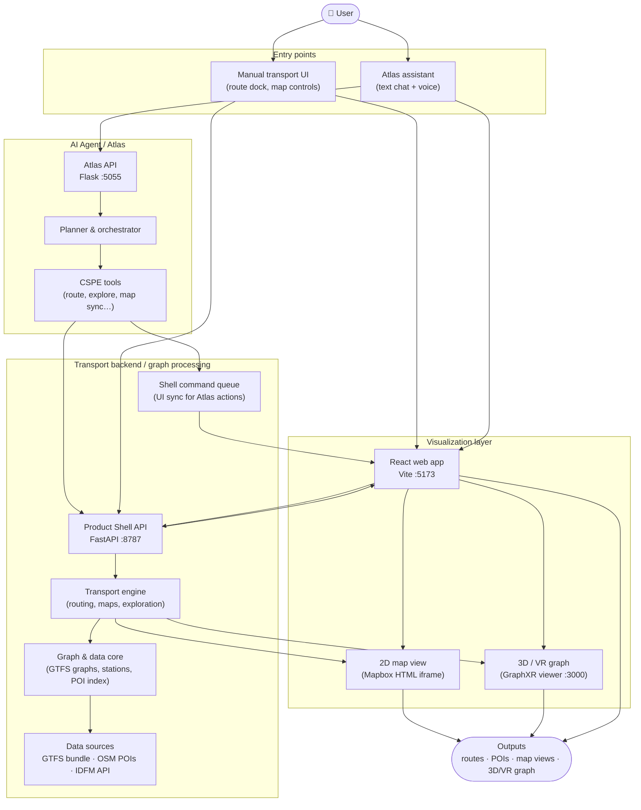
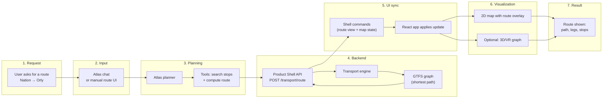

# CSPE — Presentation Architecture Diagrams

Two high-level diagrams for PowerPoint reuse. They reflect the current CSPE codebase: React frontend, FastAPI product shell, Atlas agent, GTFS graph engine, Mapbox maps, and GraphXR 3D/VR viewer.

---

## 1. Global project architecture

### What this diagram shows

CSPE is organized around three functional blocks. The **AI Agent / Atlas** block turns natural-language requests into structured actions. The **Transport backend / graph processing** block runs routing, exploration, and map generation on Île-de-France transport data. The **Visualization layer** turns those results into interactive views in the browser.

The user can enter the system in two ways: through the **manual transport UI** (search, route dock, map controls) or through **Atlas** (text or voice). Both paths converge on the same backend and the same visual outputs.

### Main components

| Block | Key elements |
|-------|----------------|
| **AI Agent / Atlas** | Flask API, planner, orchestrator, registered CSPE tools |
| **Transport backend** | Product Shell API, transport engine, GTFS graph bundle, POI index, optional IDFM enrichment, shell command queue |
| **Visualization layer** | React app, Mapbox-based 2D map, GraphXR 3D/VR graph viewer |

### Why this architecture is useful

It **separates concerns**: Atlas handles language and planning; the backend handles transport logic and data; the frontend handles presentation. Atlas never renders maps directly—it calls the backend and pushes UI updates through a small command queue. That keeps the same routing engine and visualizations usable from both manual UI and AI-driven flows.

---

## 2. Example request flow

**Example:** *“Find a route from Nation to Aéroport d’Orly”*

This matches a typical Atlas route request (`cspe_search_stops` → `cspe_compute_route`) or the equivalent manual route in the transport dock.

### What this diagram shows

This is a **step-by-step path** from one user request to a visible result. The user asks for a route; Atlas (or the manual UI) forwards the request to the backend. The transport engine resolves stop names, runs shortest-path routing on the pre-built GTFS graph, and returns path data. The backend then notifies the browser, which refreshes the map—and optionally opens the 3D/VR graph—with the computed route.

The same backend route is used whether the request comes from Atlas or from the manual route panel; only the entry point differs.

### Main components in this flow

1. **User** — natural-language or form-based route request  
2. **Atlas / manual UI** — chat rail or route dock in the React app  
3. **Planner & tools** — resolve “Nation” and “Orly”, call routing APIs  
4. **Product Shell + transport engine** — route computation on the graph bundle  
5. **Shell command queue** — pushes route state to the browser without Atlas touching the DOM  
6. **Map / GraphXR** — 2D route overlay and optional 3D network view  

### Why this flow is useful

It shows that CSPE is not “AI drawing a map.” The **graph logic lives in the backend** on real GTFS data; Atlas is a **controller** that triggers the same APIs a user could call manually. That makes results **reproducible, testable, and consistent** across voice, chat, and manual use.

---

## Notes for PowerPoint

- Copy each Mermaid block into [Mermaid Live Editor](https://mermaid.live) or a Mermaid-capable export tool to generate PNG/SVG slides.
- For a single slide, use diagram 1 for “system overview” and diagram 2 for “how a route request works.”
- Ports shown (5055, 8787, 5173, 3000) match the default `run_web_app.ps1` dev stack.
